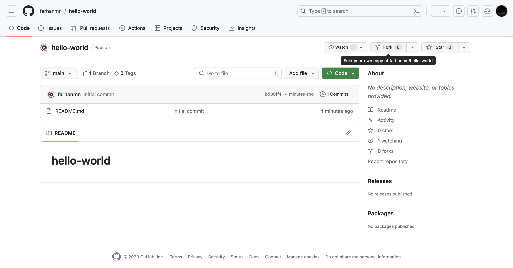
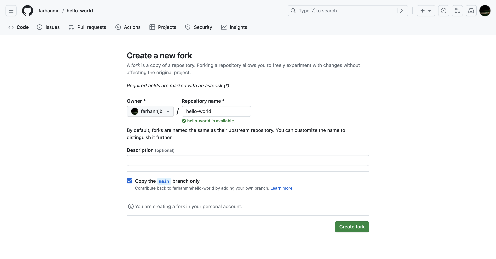
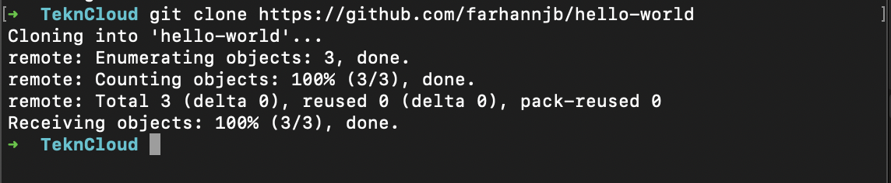
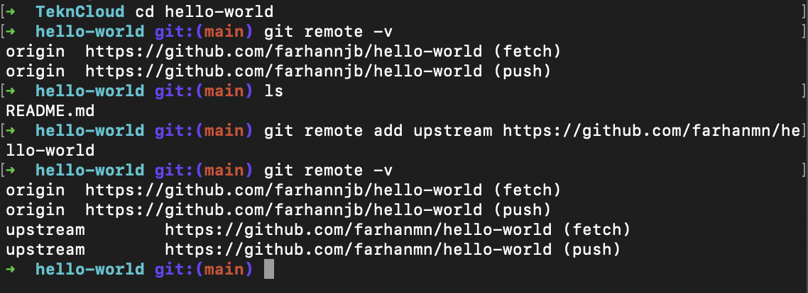
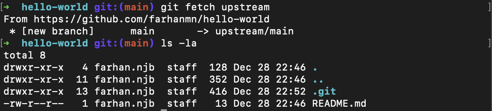
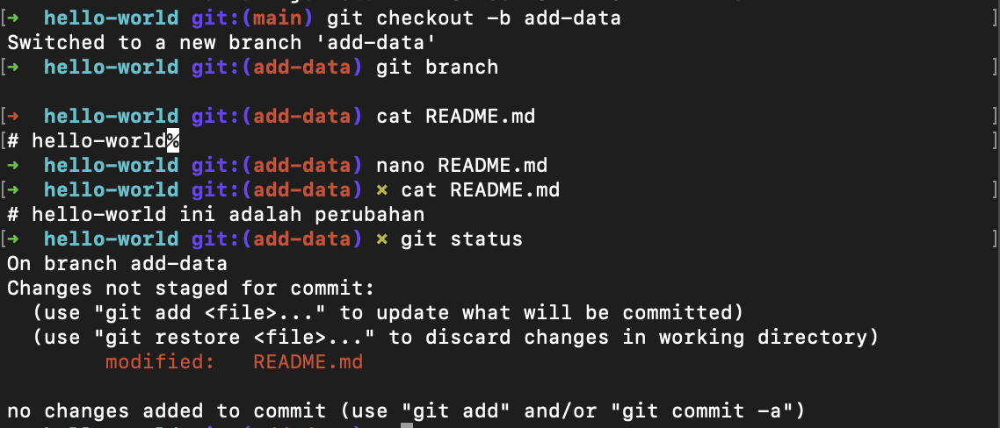
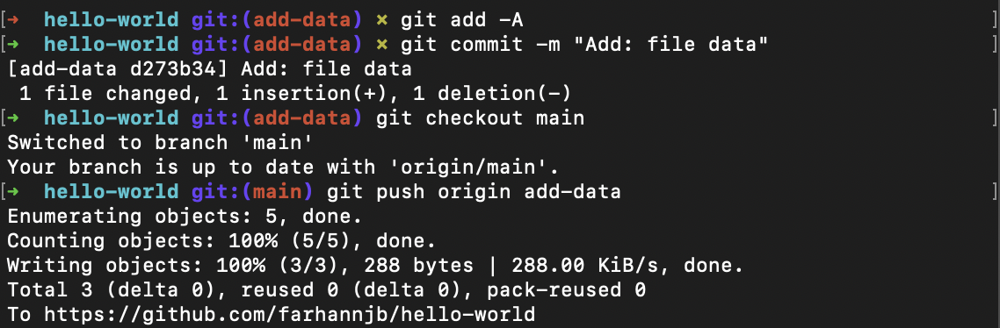

# Git Kolaborasi

### Fork Repo

- Melakukan fork terhadap repo yang ada
  

- Membuat fork
  

### Clone



### Konfigurasi Upstream



```
// Melakukan upstream ke repo utama
$ git remote add upstream https://github.com/farhanmn/hello-world
```

## Mengirimkan Pull Request

### Membuat Perubahan di Repo Lokal

- Melakukan sinkronisasi repo lokal dengan repo dari upstream author
  

- Melakukan perubahan data
  

```
// membuat branch baru dengan nama add-data
$ git checkout -b add-data

// menampilkan isi dari file README.md
$ cat README.md

// edit isi README.md menggunakan nano
$ nano README.md

// cek perubahan
$ git status
```

- Push
  
