# 1. Instalasi GIT

Menampilkan dan melakukan pengecekan versi pada GIT yang telah diinstall

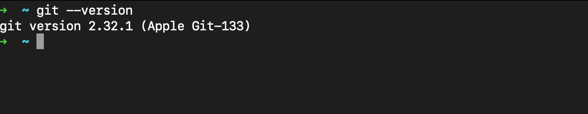

# 2. Konfigurasi GIT

Melakukan konfigurasi sebagai berikut

```
$ git config --global user.name "Muhammad Farhan N"
$ git config --global user.email "najibfarhan3@gmail.com"
```

Melihat dan menampilkan hasil

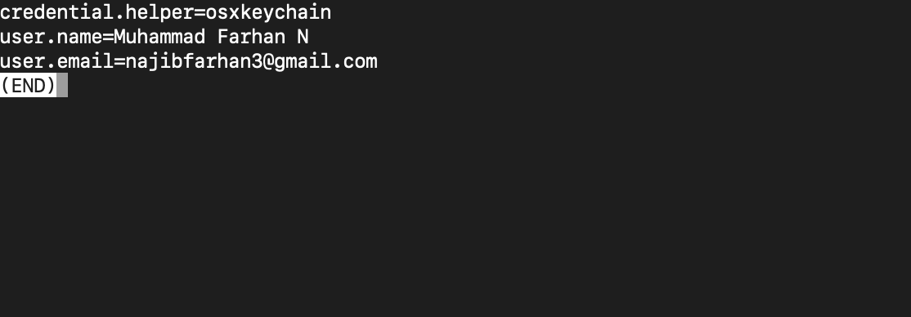

# 3. Mengelola Repo Sendiri

## Membuat Repo

Melakukan pembuatan repo melalui Github

Hasil pembuatan repo:

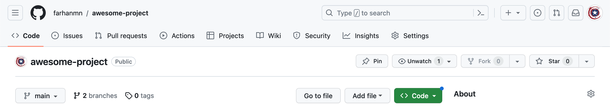

## Clone Repo ke komputer lokal

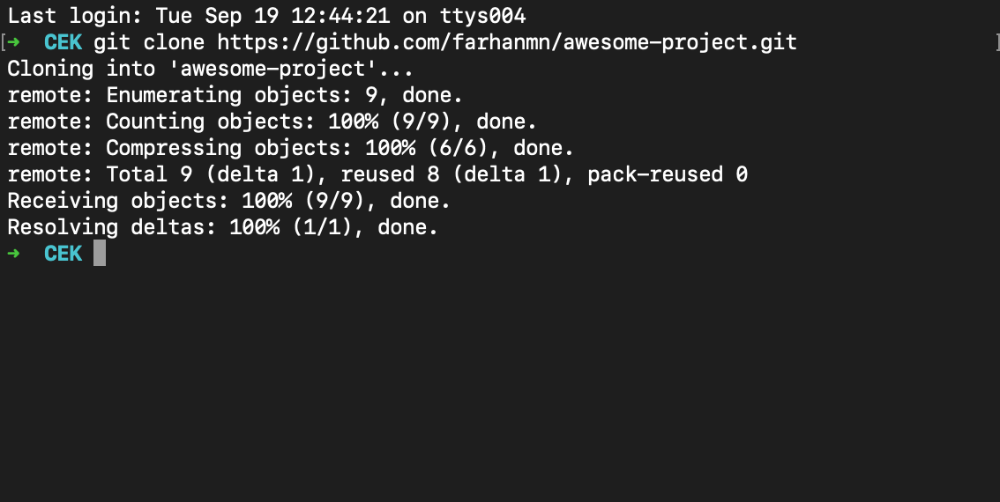

## Mengelola Repo

### Mengubah Isi - Push Tanpa Branching dan Merging

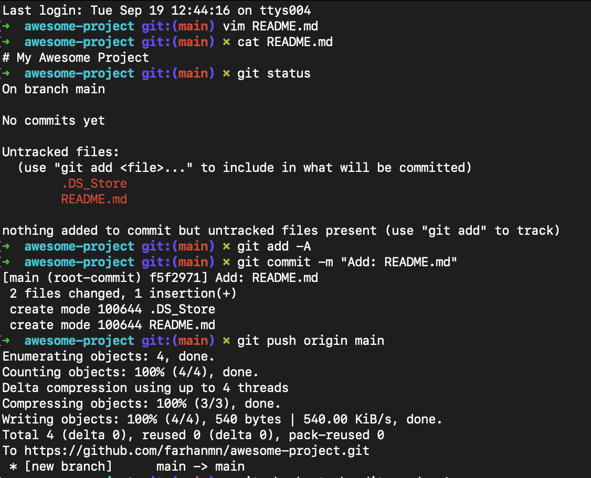

### Mengubah Isi dengan Branching and Merging

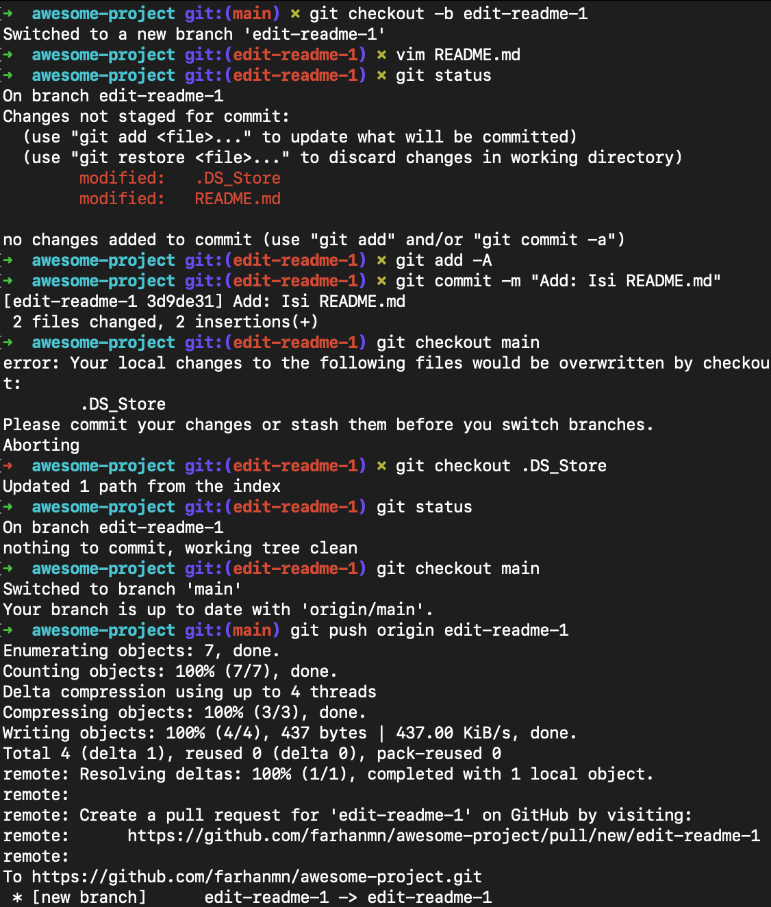

### Melakukan PR (Pull Request)

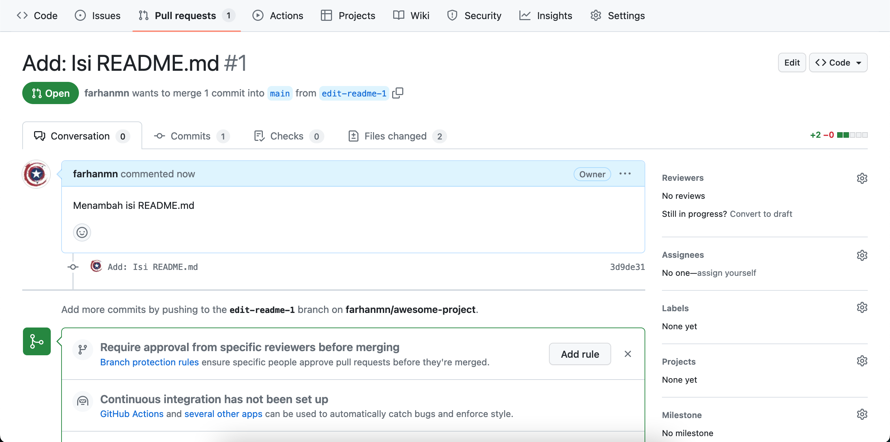

### Merge Pull Request yang sebelumnya sudah dilakukan

Dari PR yang telah di lakukan sebelumnya, kemudian dilakukan merge

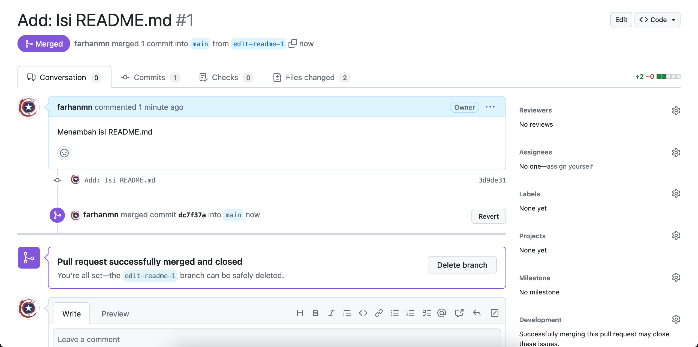

### Melakukan merge di komputer lokal dan sinkronisasi

Setelah dilakukan merge dari PR sebelumnya, kemudian dilakukan sinkronisasi di komputer lokal dengan melakukan hal berikut:

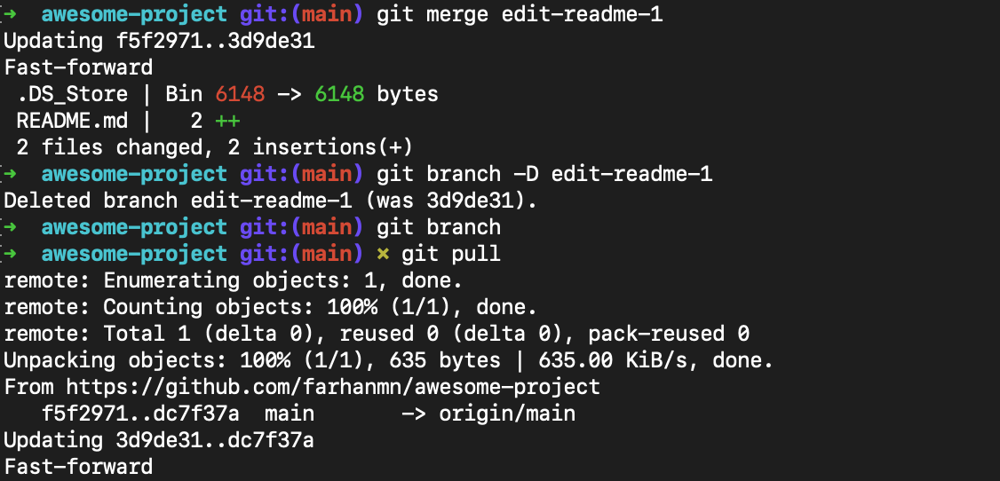

### Membatalkan Perubahan

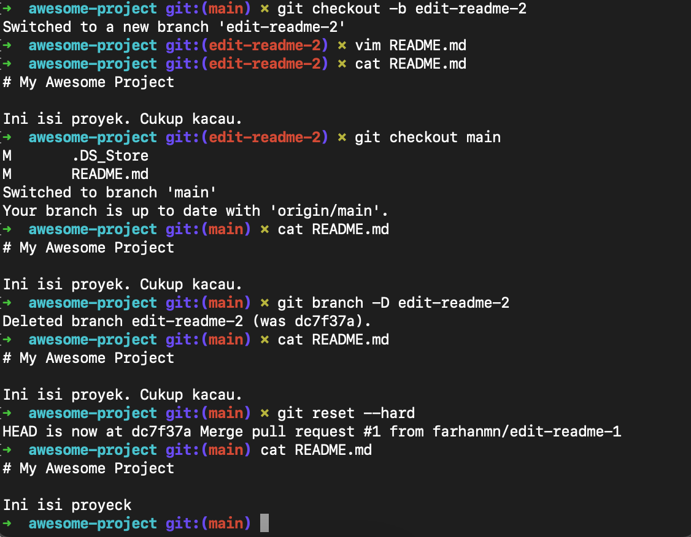

### Undo Commit Terakhir

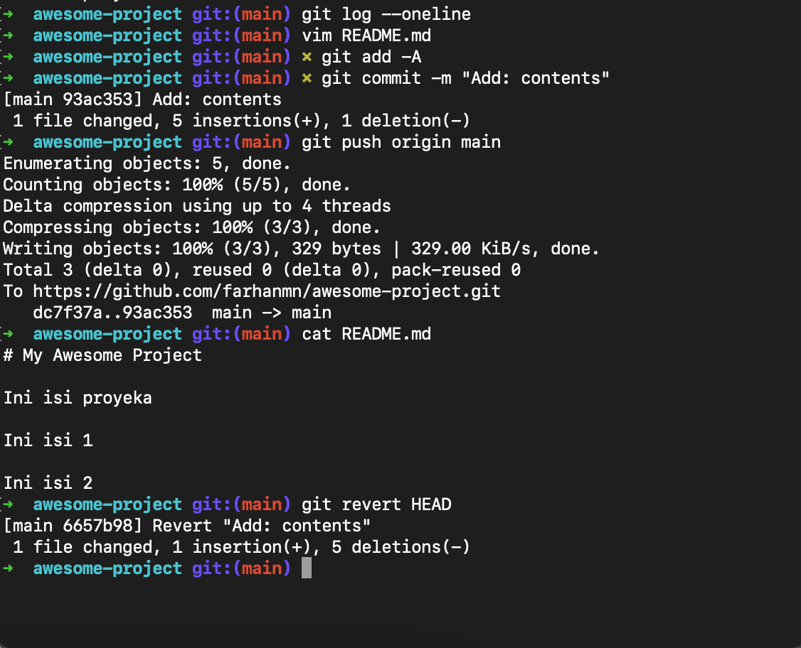
