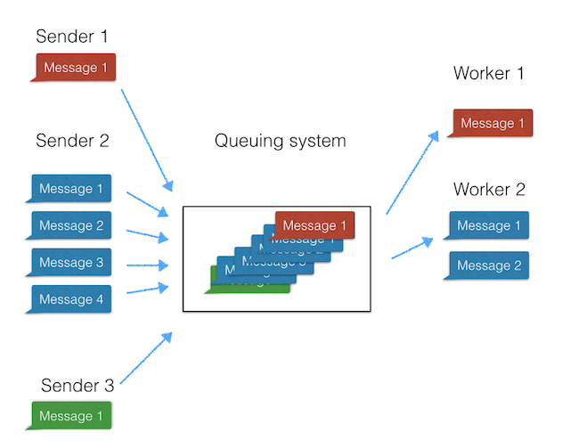

# Layanan Software as a Service

## Perbedaan IaaS, SaaS, dan PaaS

IaaS (Infrastructure as a Service), SaaS (Software as a Service), dan PaaS (Platform as a Service) adalah tiga model layanan utama dalam komputasi awan yang menawarkan pendekatan yang berbeda untuk menyediakan dan mengelola sumber daya IT. IaaS memberikan pengguna akses ke infrastruktur komputasi dasar seperti server, penyimpanan, dan jaringan yang dapat disewa, memberikan tingkat kontrol yang tinggi kepada pengguna untuk mengelola sistem operasi, aplikasi, dan data mereka. SaaS, di sisi lain, menyediakan aplikasi dan perangkat lunak melalui internet, membebaskan pengguna dari tanggung jawab instalasi dan pemeliharaan, sehingga mereka dapat fokus pada penggunaan aplikasi tersebut. PaaS berada di tengah-tengah, menyediakan platform pengembangan dan alat untuk membangun, menguji, dan menyebarkan aplikasi tanpa perlu mengelola infrastruktur yang mendasarinya. Dengan demikian, perbedaan utama di antara ketiganya terletak pada tingkat kontrol dan tanggung jawab pengguna terhadap infrastruktur, platform, atau aplikasi, yang sesuai dengan kebutuhan dan preferensi pengguna dalam konteks pengembangan dan penggunaan sumber daya IT dalam lingkungan awan.

## Arsitektur SaaS

Arsitektur SaaS (Software as a Service) adalah model arsitektur yang dirancang untuk menyediakan akses dan penggunaan perangkat lunak melalui internet. Arsitektur ini memiliki beberapa karakteristik utama:

1. Akses melalui Web: Aplikasi SaaS diakses oleh pengguna melalui antarmuka web yang nyaman, tanpa memerlukan instalasi lokal. Pengguna dapat menggunakan aplikasi secara langsung dari perangkat yang terhubung ke internet.
2. Multitenancy: Arsitektur SaaS mendukung model multi-tenant, yang berarti beberapa pengguna atau pelanggan dapat menggunakan aplikasi yang sama secara bersamaan. Ini dicapai dengan membagi dan mengisolasi data, konfigurasi, dan fungsionalitas untuk setiap pengguna atau pelanggan.
3. Skalabilitas Otomatis: SaaS dapat dengan mudah dikonfigurasi untuk menyesuaikan jumlah pengguna atau kapasitas komputasi sesuai kebutuhan. Ini memungkinkan skalabilitas otomatis untuk menangani lonjakan beban tanpa memerlukan intervensi manual.
4. Pembaruan Otomatis: Penyedia SaaS bertanggung jawab atas pemeliharaan dan pembaruan aplikasi. Pembaruan dilakukan secara otomatis oleh penyedia tanpa mengganggu pengguna, sehingga memastikan bahwa pengguna selalu menggunakan versi terbaru dan paling aman dari perangkat lunak.
5. Keamanan dan Kepatuhan: Keamanan data dan akses merupakan prioritas dalam arsitektur SaaS. Penyedia layanan mengimplementasikan tindakan keamanan tingkat tinggi dan seringkali menyertakan kontrol akses, enkripsi data, serta kepatuhan dengan regulasi dan standar keamanan tertentu.
6. Biaya Berbasis Langganan: Model bisnis SaaS umumnya didasarkan pada langganan bulanan atau tahunan, yang memungkinkan pengguna membayar hanya untuk layanan yang mereka gunakan. Ini memberikan fleksibilitas dan transparansi biaya.
7. Integrasi Mudah: Arsitektur SaaS memfasilitasi integrasi dengan layanan dan aplikasi lain, baik dalam lingkup ekosistem SaaS yang sama maupun dengan layanan pihak ketiga. Hal ini memungkinkan organisasi untuk menghubungkan aplikasi SaaS dengan sistem internal mereka.

Dengan karakteristik ini, arsitektur SaaS memberikan keuntungan efisiensi, skalabilitas, dan kenyamanan dalam penggunaan dan manajemen perangkat lunak tanpa memerlukan overhead operasional yang signifikan bagi pengguna akhir

## Membangun Aplikasi Berbasis SaaS

Semakin banyak diluncurkannya bisnis aplikasi SaaS pada hari ini menunjukkan pertumbuhan pesat industri ini yang menarik perhatian banyak orang dan perusahaan. Dalam menghadapi pertumbuhan ini, organisasi semakin mengarah pada penggunaan aplikasi yang berbasis cloud. Penskalaan di cloud, dengan semua manfaat dan risikonya, menjadi hal penting dalam membangun arsitektur SaaS.

Pertama-tama, saat membangun aplikasi SaaS global, memanfaatkan cloud adalah keputusan yang bijak. Dalam artikel ini, kita akan membahas langkah-langkah membangun arsitektur SaaS berbasis cloud. Mulai dari bahasa pemrograman hingga pemilihan basis data, fokus pada aspek-aspek penting yang perlu diperhatikan.

Dalam memilih bahasa pemrograman, penting untuk memilih bahasa modern yang sesuai dengan kebutuhan dan keterbacaan kodenya. Dengan banyaknya opsi bahasa pemrograman modern, seperti yang telah kami rangkum pada tahun 2017, eksperimen dan pilihlah yang paling sesuai. Sebagai contoh, Python menjadi pilihan yang aman dengan fleksibilitas dan kemampuan untuk berbagai kasus penggunaan.

Selanjutnya, instalasi basis data merupakan langkah selanjutnya dalam membangun aplikasi SaaS. Rekomendasi kami adalah menggunakan basis data berorientasi dokumen, yang berbeda dengan konsep tradisional basis data relasional. Basis data dokumen memberikan fleksibilitas yang lebih besar, terutama dalam menghadapi perubahan, dan seringkali mengurangi ukuran basis data. Sebagai contoh, MongoDB menjadi pilihan kami karena kinerja tinggi, ketersediaan tinggi, dan skalabilitas yang mudah, penting dalam bisnis SaaS global yang berfokus pada pertumbuhan.

Dengan demikian, membangun arsitektur SaaS berbasis cloud melibatkan pemilihan bahasa pemrograman modern, pemilihan basis data berorientasi dokumen, dan kesadaran akan kebutuhan skalabilitas. Semua langkah ini memberikan dasar yang kuat untuk membangun aplikasi SaaS yang dapat bersaing dan bertahan dalam era komputasi awan yang terus berkembang.

### Sistem Antrian

Sistem antrian pesan merupakan protokol komunikasi asinkron, memungkinkan pengirim dan penerima pesan untuk tidak berinteraksi secara bersamaan. Dikenal juga sebagai teknologi Message Queuing (MSMQ), sistem ini memungkinkan aplikasi web berjalan pada waktu yang berbeda dan berkomunikasi secara asinkron dengan berbagai integrasi pihak ketiga, API, dan layanan lainnya.

### Amazon Web Service dan EC2

Membangun aplikasi web yang dapat diskalakan mungkin akan berujung pada penggunaan Layanan Web Amazon, cepat atau lambat. AWS memungkinkan untuk meng-host dan menjalankan aplikasi web, serta melakukan pekerjaan batch berkinerja tinggi dalam skala besar. Dengan Elastic Compute Cloud (EC2), AWS menyediakan server virtual yang dapat diubah skala sesuai kebutuhan setiap bisnis.

