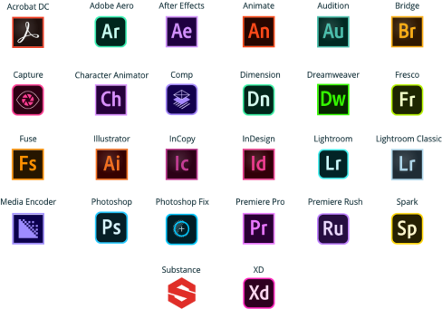
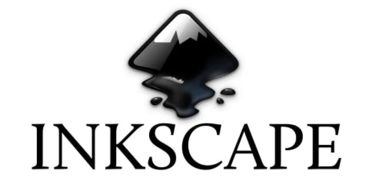

# Contoh Layanan Software as a Service

## Layanan Cloud dalam Desain Grafis

### 1. Adobe Creative Cloud (Adobe CC)

Adobe Creative Cloud (Adobe CC) adalah platform langganan berbasis cloud yang dikembangkan oleh Adobe Inc., yang menyediakan berbagai aplikasi dan layanan kreatif bagi para profesional dan pencipta konten. Adobe CC membawa sejumlah alat desain grafis, pengembangan web, fotografi, dan penyuntingan video ke dalam satu paket terpadu.

Beberapa aplikasi terkenal yang termasuk dalam Adobe CC antara lain Adobe Photoshop untuk penyuntingan gambar, Adobe Illustrator untuk desain vektor, Adobe Premiere Pro untuk penyuntingan video, serta Adobe InDesign untuk desain tata letak. Selain itu, platform ini juga menyediakan aplikasi seperti Adobe Lightroom untuk pengelolaan foto, Adobe Dreamweaver untuk pengembangan web, dan Adobe Acrobat DC untuk membuat dan mengelola file PDF.

Keunggulan Adobe CC terletak pada model berlangganannya yang memungkinkan pengguna mendapatkan akses ke seluruh paket aplikasi dan pembaruan terbaru. Melalui Adobe Creative Cloud, pengguna dapat menyimpan dan mengelola proyek mereka secara online, berkolaborasi dengan tim, dan mengakses berbagai sumber daya seperti template, font, dan gambar melalui layanan Adobe Stock.

Adobe CC menciptakan ekosistem yang terintegrasi untuk kreativitas, memungkinkan pengguna menjalankan proyek desain mereka dengan lebih efisien dan efektif. Dengan fleksibilitas dan inovasi yang ditawarkan oleh Creative Cloud, Adobe terus mendukung dan mempermudah perjalanan kreatif para profesional di berbagai bidang, mulai dari desain grafis hingga produksi multimedia

Berikut adalah beberapa komponen utama yang termasuk dalam Adobe Creative Cloud:

1. Adobe Photoshop:
   Aplikasi penyuntingan gambar dan desain grafis yang sangat populer, digunakan untuk manipulasi gambar, pembuatan desain, dan retouching foto.
2. Adobe Illustrator:
   Aplikasi desain vektor yang digunakan untuk membuat ilustrasi, logo, ikon, dan grafik berbasis vektor lainnya.
3. Adobe InDesign:
   Aplikasi desain tata letak dan penerbitan digital yang digunakan untuk membuat buku, majalah, brosur, dan materi cetak lainnya.
4. Adobe Premiere Pro:
   Aplikasi penyuntingan video profesional yang digunakan untuk membuat dan mengedit film, video, dan konten visual bergerak lainnya.
5. Adobe After Effects:
   Aplikasi untuk membuat efek visual dan animasi yang kompleks dalam video, sering digunakan untuk produksi film dan video promosi.

### 2. Canva

Canva adalah platform desain grafis daring yang memungkinkan pengguna dengan berbagai tingkat keterampilan untuk membuat berbagai materi visual dengan mudah dan cepat. Diluncurkan pada tahun 2012, Canva telah menjadi alat populer di kalangan individu, bisnis, dan lembaga pendidikan.

Fitur utama Canva melibatkan antarmuka pengguna yang ramah pengguna dan berbagai template desain yang dapat disesuaikan. Pengguna dapat membuat poster, undangan, presentasi, media sosial, hingga materi pemasaran dengan hanya beberapa klik. Canva juga menyediakan elemen desain, ikon, dan gambar stok, yang dapat digunakan untuk meningkatkan kreativitas proyek.

Canva memungkinkan kolaborasi dalam waktu nyata, memungkinkan tim untuk bekerja bersama pada satu proyek desain. Fitur ini membantu mempercepat proses produksi dan memastikan konsistensi desain.

Meskipun Canva menyediakan versi gratisnya, Canva Pro memberikan fitur tambahan seperti penyimpanan cloud yang lebih besar, akses ke elemen premium, dan kemampuan untuk membuat tim kolaboratif.

Dengan kesederhanaan dan ketersediaan berbagai elemen desain yang bervariasi, Canva membuka pintu bagi siapa saja untuk mengekspresikan kreativitas mereka tanpa memerlukan keterampilan desain yang mendalam. Ini membuat desain grafis menjadi lebih demokratis dan dapat diakses oleh semua orang, dari pemula hingga profesional desain.

## Layanan Non-Cloud untuk Desain Grafis

### 1. Inkscape

Inkscape adalah senjata rahasia para kreator visual yang berani mengeksplorasi dunia desain grafis. Sebagai perangkat lunak vektor yang sepenuhnya gratis dan sumber terbuka, Inkscape membuka pintu menuju kreativitas tanpa batas, membawa desain grafis ke dalam genggaman semua orang.

Dengan antarmuka yang ramah pengguna, Inkscape memudahkan pengguna untuk membuat ilustrasi vektor, logo, dan grafik dengan kebebasan tak terbatas. Fitur-fitur canggih seperti bezier editing, path manipulation, dan dukungan untuk SVG (Scalable Vector Graphics) membuat Inkscape menjadi teman setia bagi mereka yang ingin mengekspresikan ide mereka dengan presisi tanpa batas.

Tidak hanya sekadar perangkat lunak, Inkscape juga merupakan wadah komunitas berbakat di mana para desainer saling berbagi pengetahuan dan inspirasi. Dengan dukungan dari komunitas yang aktif, setiap pengguna Inkscape dapat mengeksplorasi potensi tak terbatas desain vektor tanpa menguras kantong.

Inkscape membuktikan bahwa kreativitas tak harus mahal. Dengan segala kelebihannya, Inkscape adalah sahabat terpercaya bagi siapa pun yang ingin merambah dunia desain grafis tanpa dibatasi oleh biaya. Inkscape: di mana kreativitas bertemu kebebasan tanpa batas!
