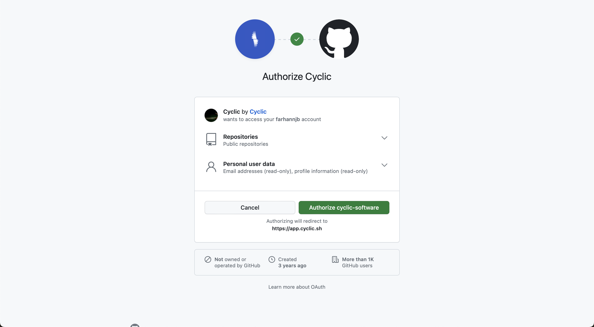
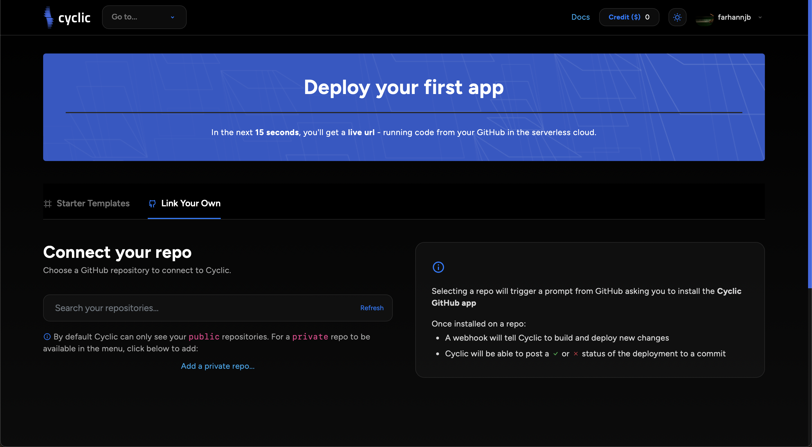
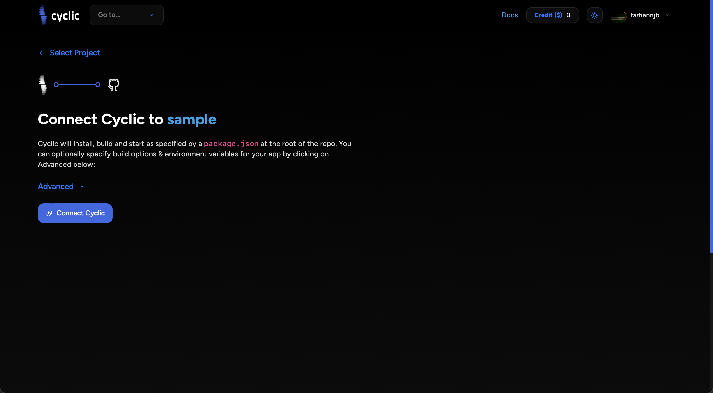
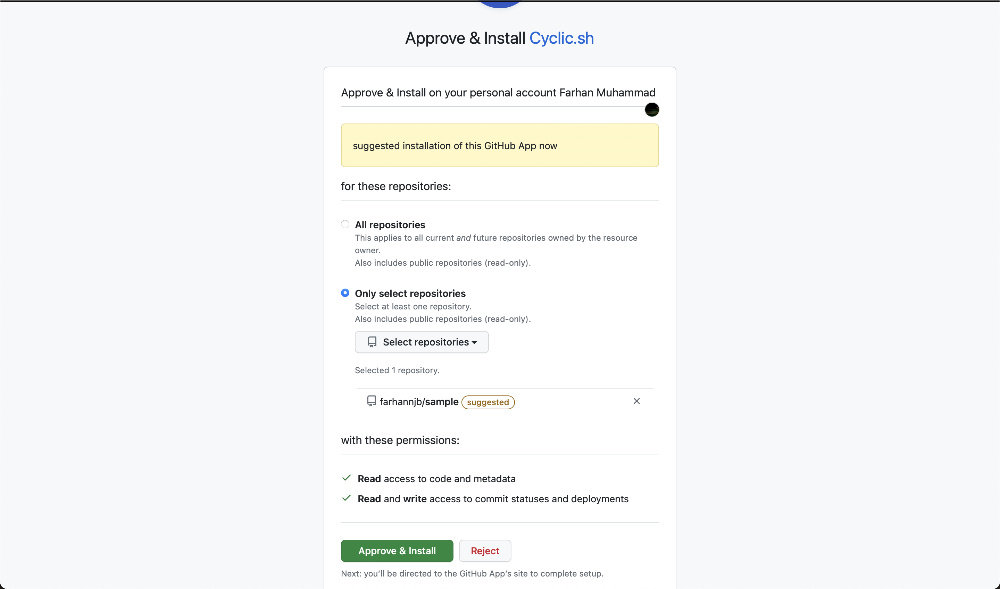
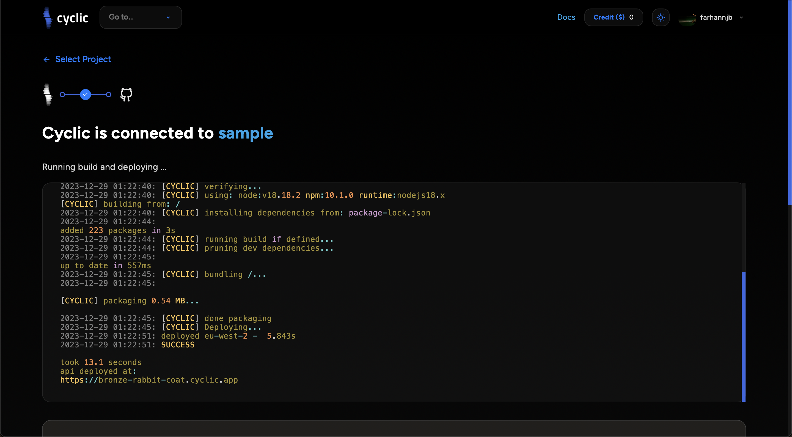
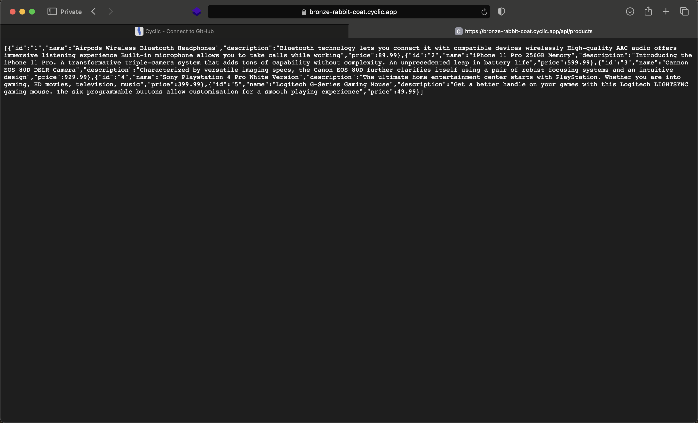

# Deploy DIY

1. Login menggunakan akun github
   

2. Melakukan deployment terhadap repo sendiri
   

3. Connect repo dengan cyclic
   

4. Approval connect repo dengan cyclic
   

5. Berhasil melakukan deploy terhadap repo sendiri
   

6. Cek deployment dengan mengunjungi URL yang telah dibuat oleh cyclic
   
