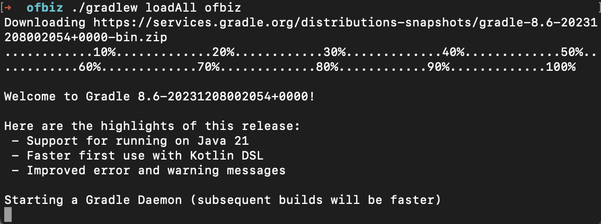
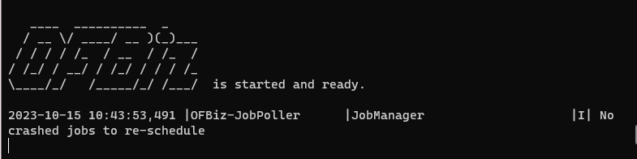
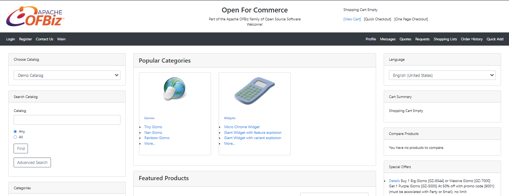

# Menginstal Apache Ofbiz

## Langkah-langkah Instalasi

Memastikan bahwa dalam PC sudah terinstall java, yaitu dengan cara melakukan pengecekan dengan melakukan perintah `java --version` kedalam terminal


Selanjutnya, lakukan pengunduhan Apache Ofbiz melalui tautan yang tersedia. Kemudian extract hasil unduhan tersebut ke folder PC lokal.

Unduh gradle-wrapper.jar melalui tautan di bawah ini:

- gradle-wrapper.jar: https://github.com/gradle/gradle/blob/v8.5.0/gradle/wrapper/gradle-wrapper.jar
- gradle-wrapper.properties: https://github.com/gradle/gradle/blob/v8.5.0/gradle/wrapper/gradle-wrapper.properties

Kemudian copy kedua file tersebut kedalam directory `ofbiz/gradle/wrapper/`

Selanjutkan lakukan instalasi gradle dengan perintah

```
$ brew install gradle
```

Masuk ke folder `ofbiz` dan lakukan perintah

```
$ ./gradlew loadAll ofbiz
```



Sistem akan melakukan proses unduh. Kemudian sistem akan menjalankan Gradle daemon.



Lakukan pengecekan dengan akses `localhost:8443/accounting`


Login menggunakan user `admin` dan password `ofbiz`


Untuk halaman e-commerce adalah sebagai berikut


