# Panduan Belanja Ofbiz E-Commerce

## Registrasi Akun

1. Pilih menu register pada halaman awal

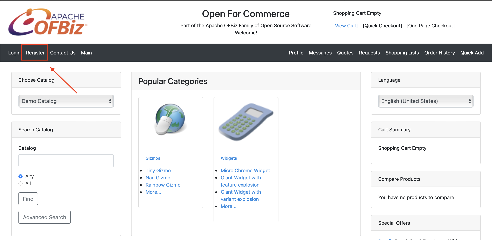

2. Lakukan pengisian data pada halaman register

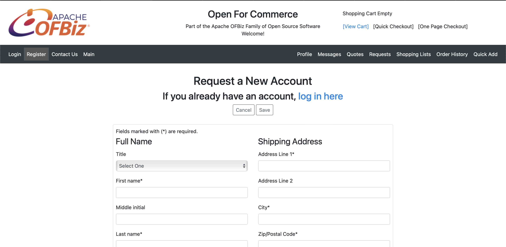

3. Klik save dan akan diarahkan ke halaman beranda

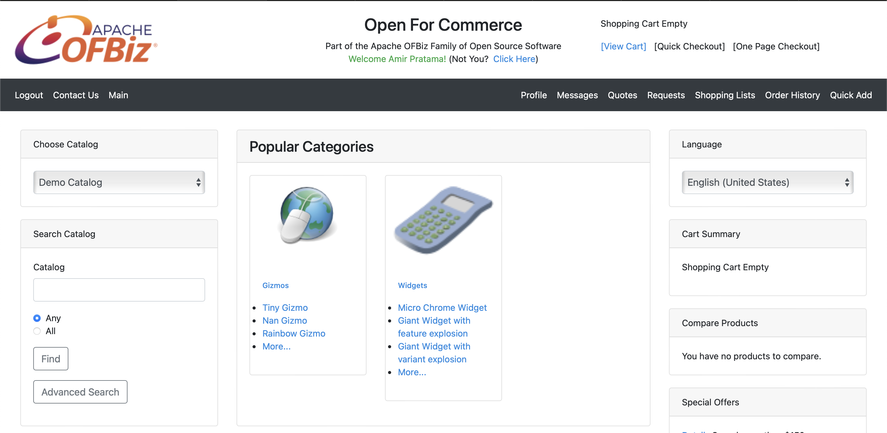

## Login

1. Masuk melalui halaman login

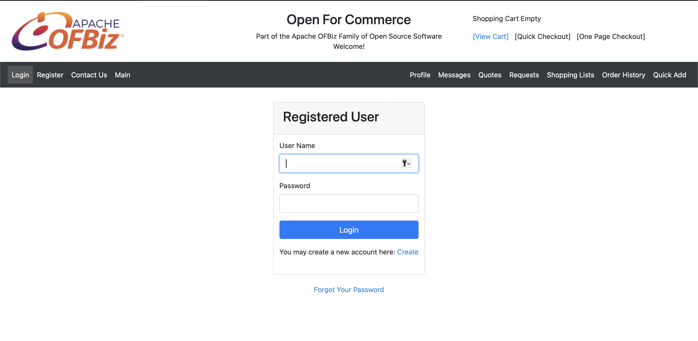

2. Jika berhasil, akan diarahkan ke halaman beranda

## Menambahkan Produk ke Keranjang

1. Setelah memilih salah satu kategori yang ada disamping kiri halaman, kemudian pilih produk yang akan ditambahkan ke keranjang dengan klik tombol `Add to Cart`

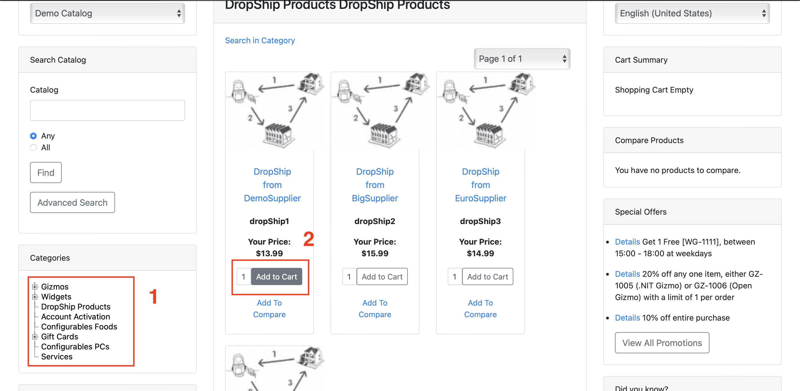

2. Kemudian produk yang telah dipilih tadi akan masuk ke keranjang

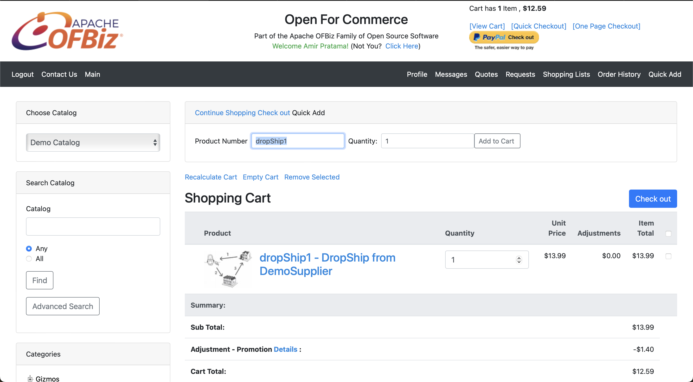

## Checkout

1. Pilih view cart yang ada dibagian atas beranda

2. Kemudian akan masuk ke halaman keranjang, lalu pilih checkout

3. Akan diarahkan ke halaman shipping. Halaman untuk menentukan alamat pengiriman. Klik **Next**

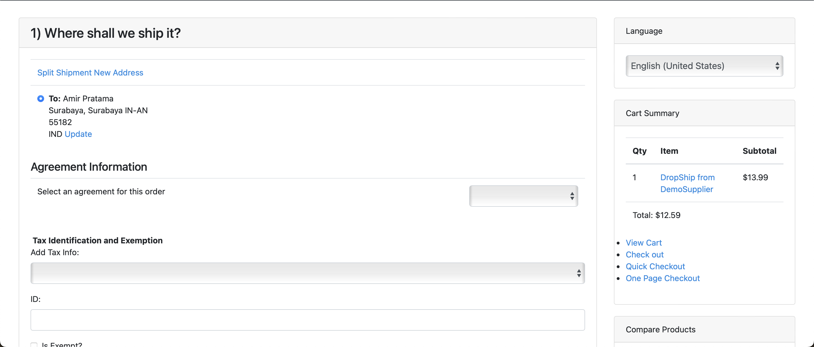

4. Kemudian menentukan metode pengiriman. Klik **Next**

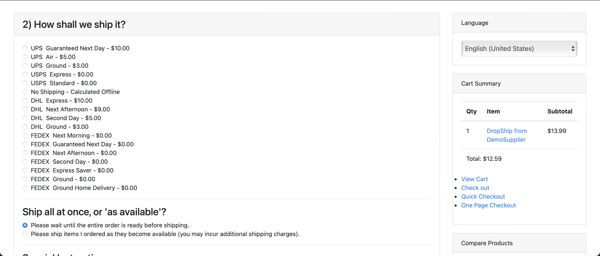

5. Lalu menentukan metode pembayaran. Klik **Next**

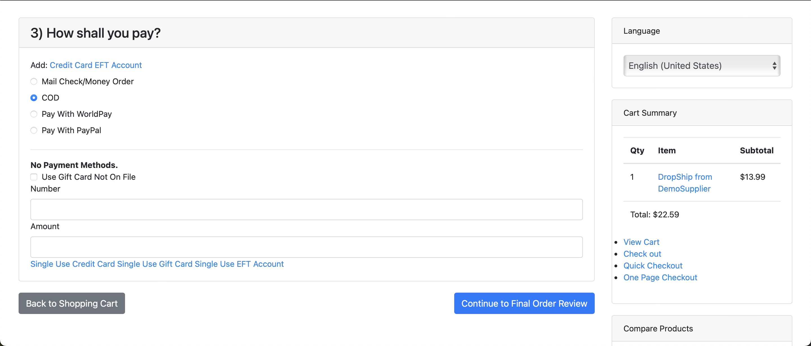

6. Halaman selanjutnya adalah review sebelum checkout. Klik **Submit Order**

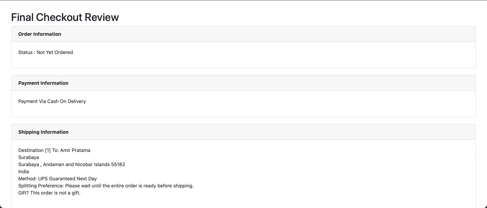

7. Proses checkout telah berhasil dilakukan

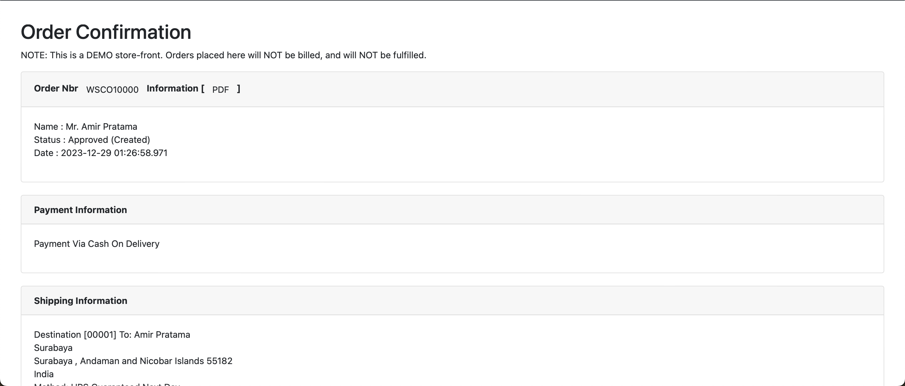
