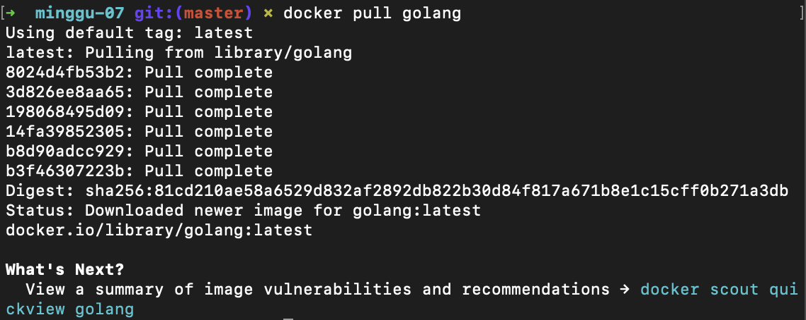
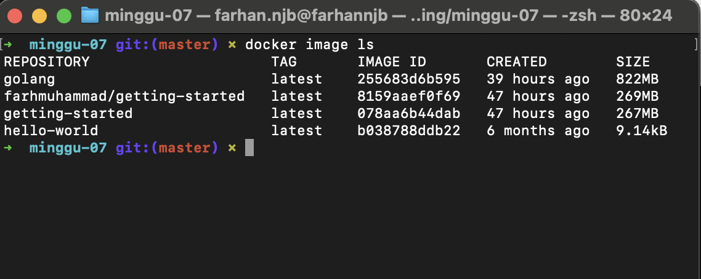
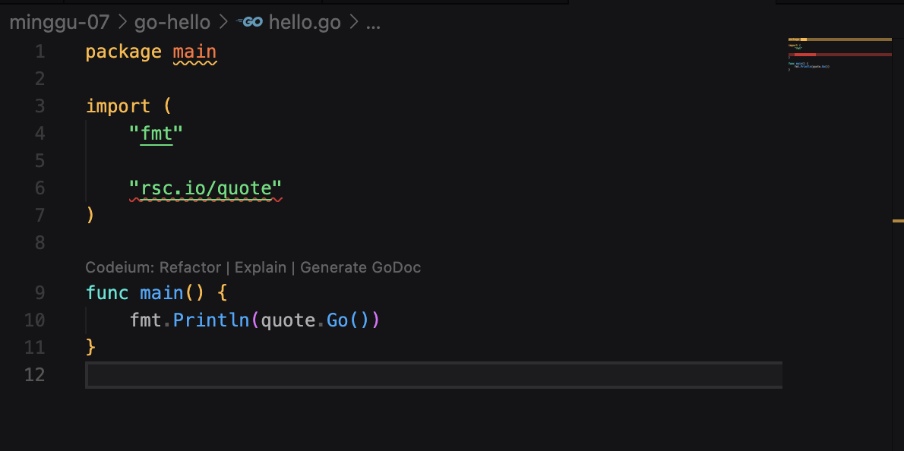
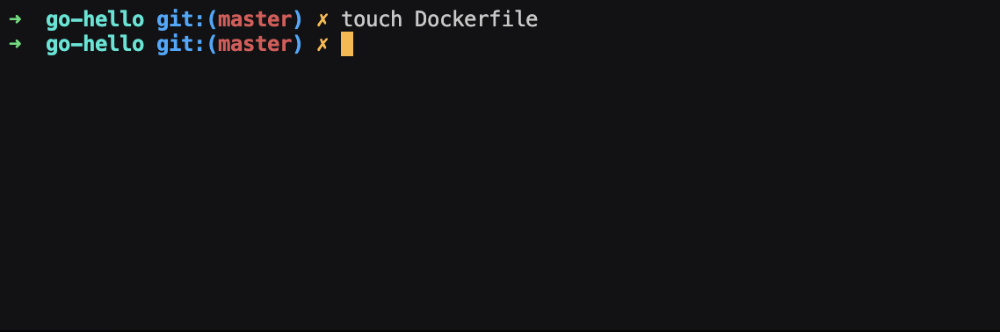
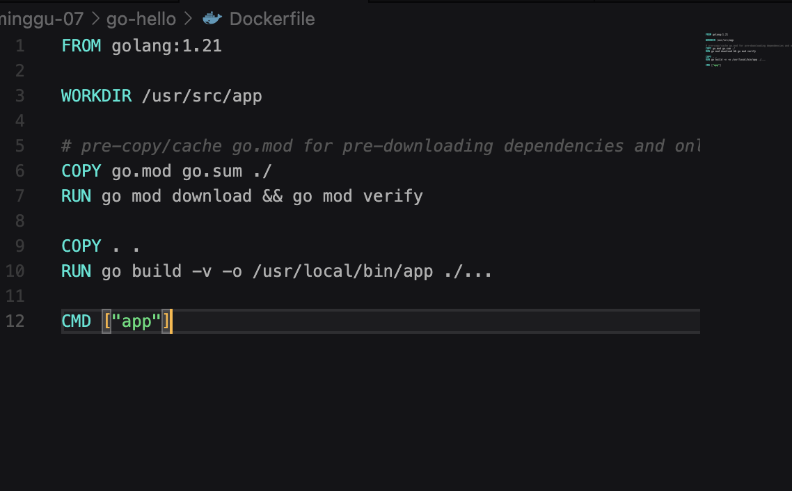
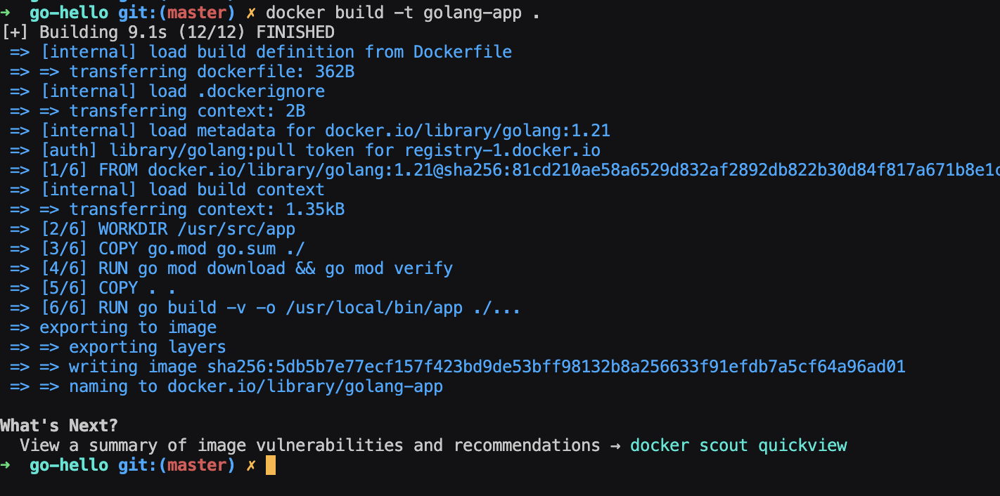
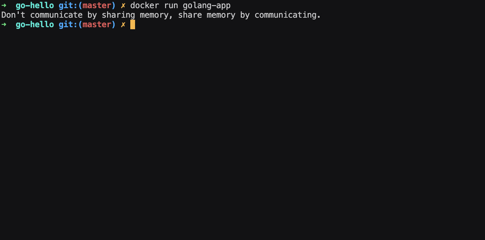

# Dokumentasi Image dari DockerHub

**Image golang**

1. Melakukan pull image dari DockerHub
   
2. Cek Image Docker
   
3. Membuat file go
   
4. Membuat Dockerfile
   
5. Edit Dockerfile
   
6. Build
   
7. Run file image dan project go bisa dijalankan menggunakan Docker
   
