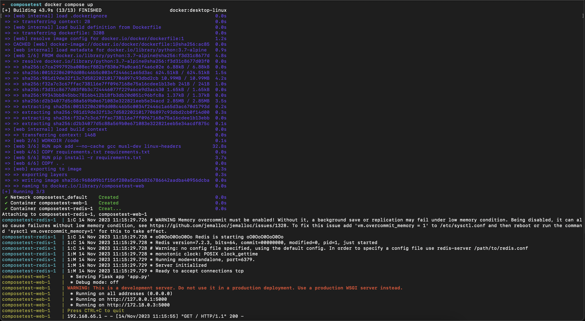
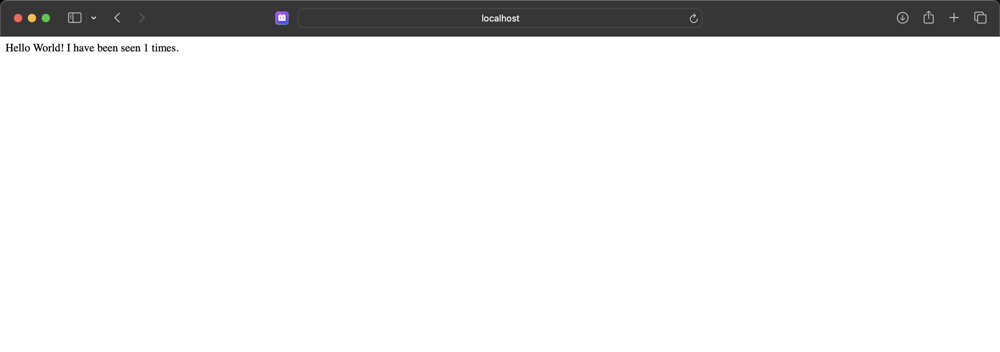

# Latihan Minggu 8

### Menggunakan Docker Compose

1. Membuat direktori

```
mkdir composetest
cd composetest
```

2. Membuat `app.py` dan memasukkan kode berikut

```
import time

import redis
from flask import Flask

app = Flask(__name__)
cache = redis.Redis(host='redis', port=6379)

def get_hit_count():
    retries = 5
    while True:
        try:
            return cache.incr('hits')
        except redis.exceptions.ConnectionError as exc:
            if retries == 0:
                raise exc
            retries -= 1
            time.sleep(0.5)

@app.route('/')
def hello():
    count = get_hit_count()
    return 'Hello World! I have been seen {} times.\n'.format(count)
```

3. Membuat `requirements.txt` dan memasukkan kode berikut

```
flask
redis
```

4. Membuat `Dockerfile` dan memasukkan kode berikut

```
# syntax=docker/dockerfile:1
FROM python:3.7-alpine
WORKDIR /code
ENV FLASK_APP=app.py
ENV FLASK_RUN_HOST=0.0.0.0
RUN apk add --no-cache gcc musl-dev linux-headers
COPY requirements.txt requirements.txt
RUN pip install -r requirements.txt
EXPOSE 5000
COPY . .
CMD ["flask", "run"]
```

5. membuat `compose.yaml` dan memasukkan kode berikut

```
services:
  web:
    build: .
    ports:
      - "8000:5000"
  redis:
    image: "redis:alpine"
```

6. Build dengan `docker compose up`
   

7. Akses `http://localhost:8000`
   
