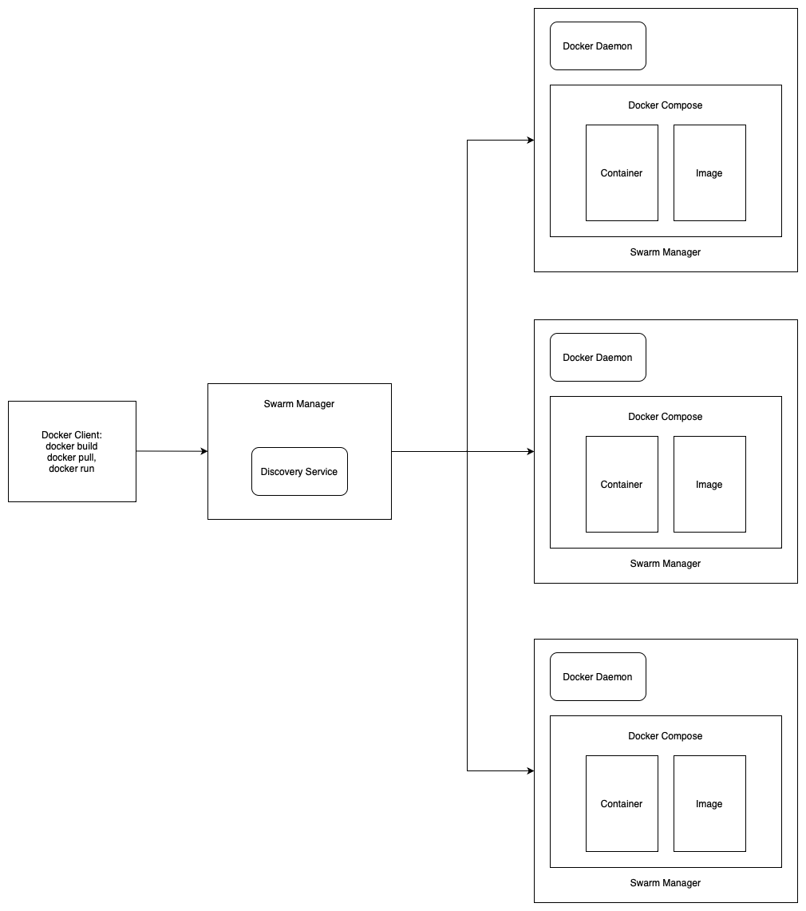

# Tugas Minggu 8

Menggambarkan Diagram Hubungan Antara:

- Docker image
- Container
- Dockerd (Docker Daemon)
- Docker client
- Docker compose
- Docker swarm

### Diagram Arsitektur Docker

### Penjelasan

- Docker Client sebagai client side yang bersinggungan langsung dengan user
- Docker Client melalui Swarm Manager menghubungi Docker Daemon di masing-masing Docker Host
- Docker Daemon kemudian berinteraksi dengan Docker Swarm untuk orkestrasi dan mengelola containers pada host yang tergabung dalam kluster
- Docker Compose digunakan untuk mendefinisikan dan menjalankan aplikasi multi-container
- Docker Image digunakan sebagai dasar dari containers yang dijalankan

Source:

- [k21academy](https://k21academy.com/docker-kubernetes/docker-swarm/)
- [researchgate](https://www.researchgate.net/figure/High-level-overview-of-Docker-architecture_fig1_308050257)
