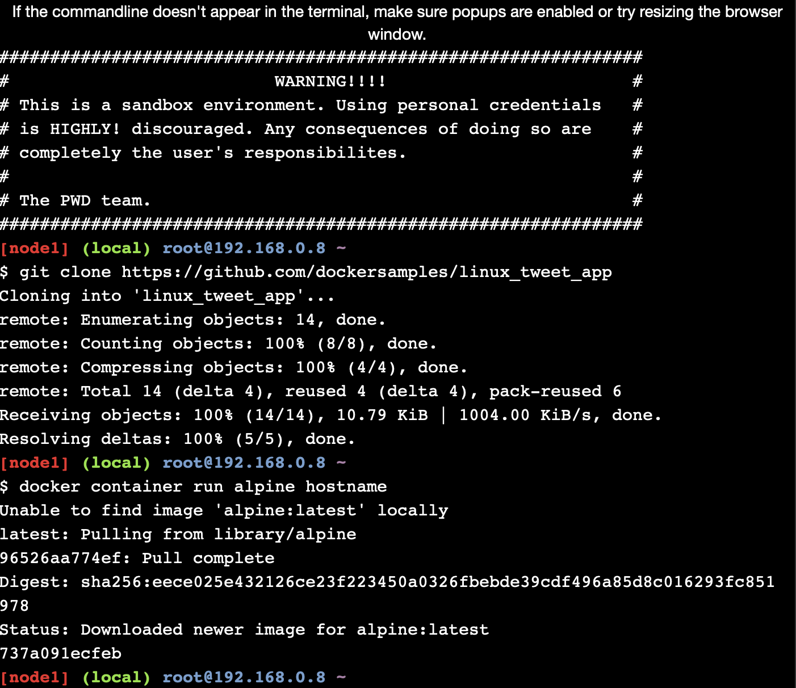
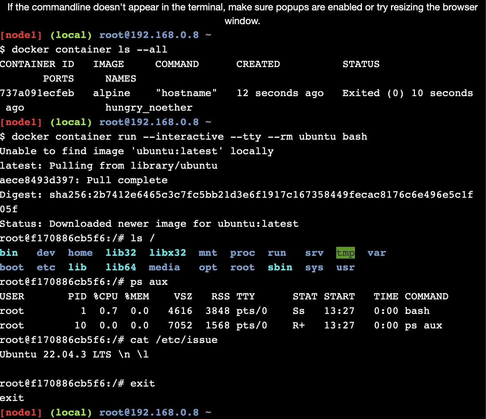
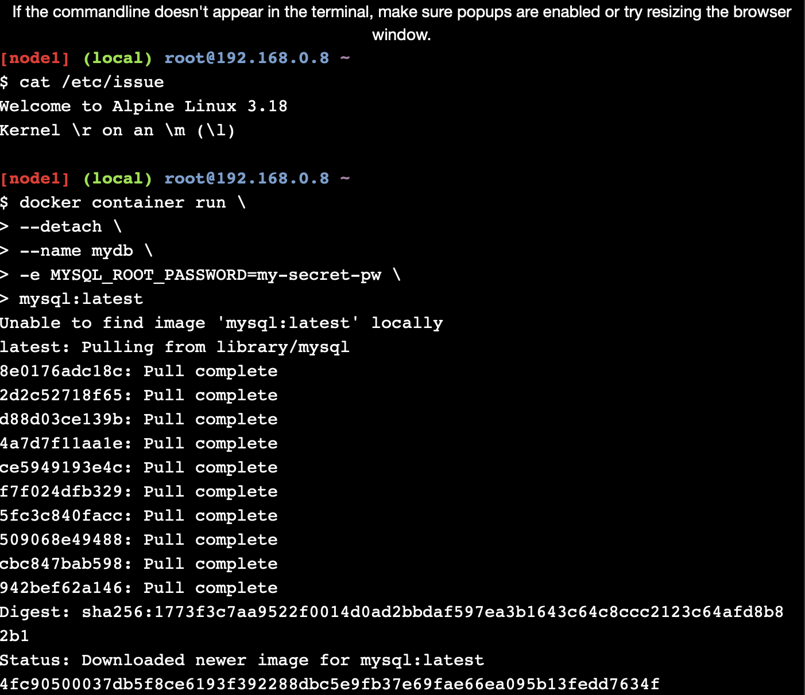
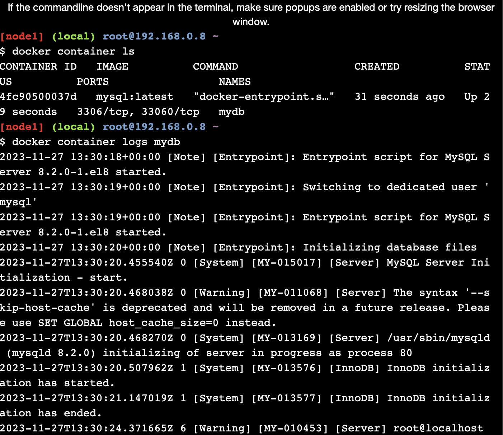
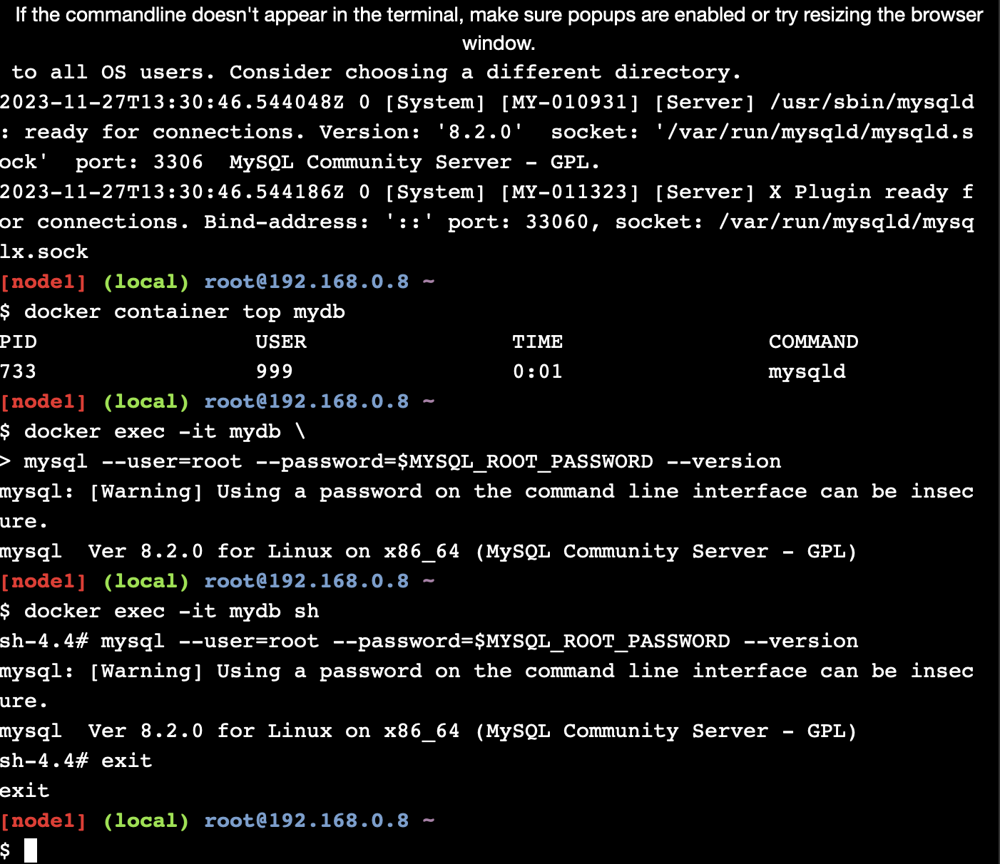
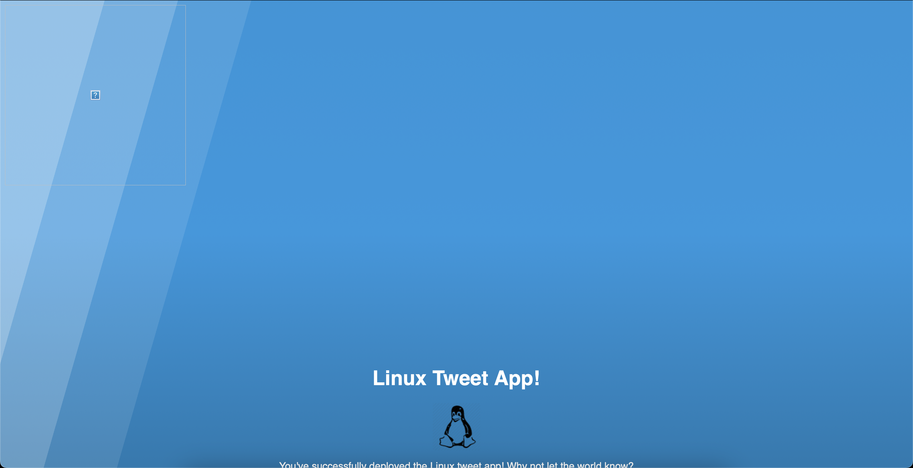
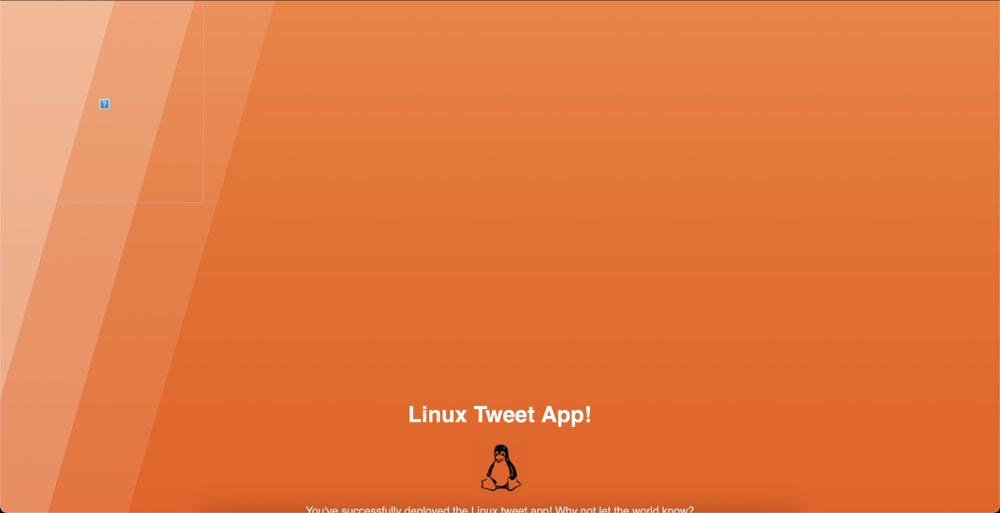
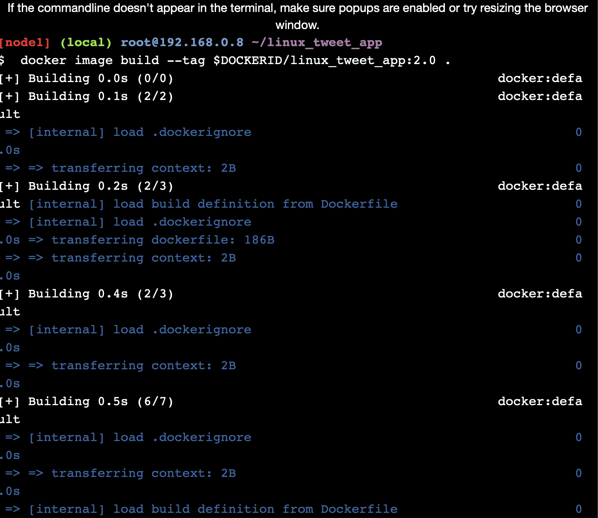
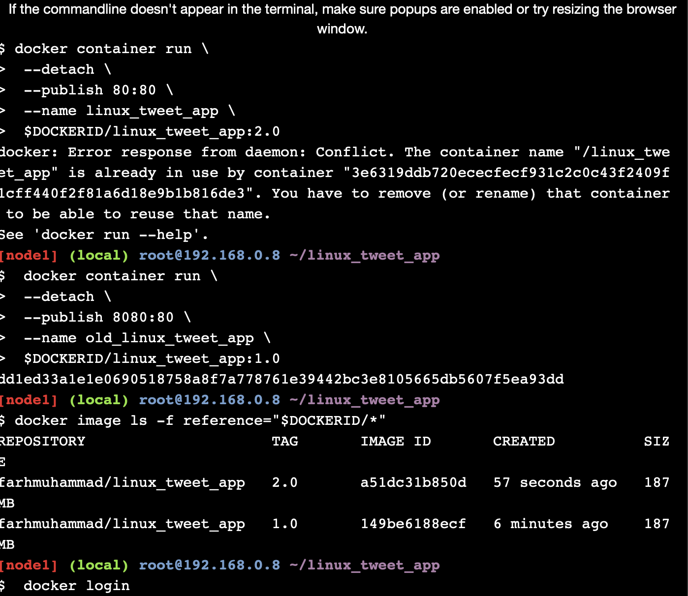
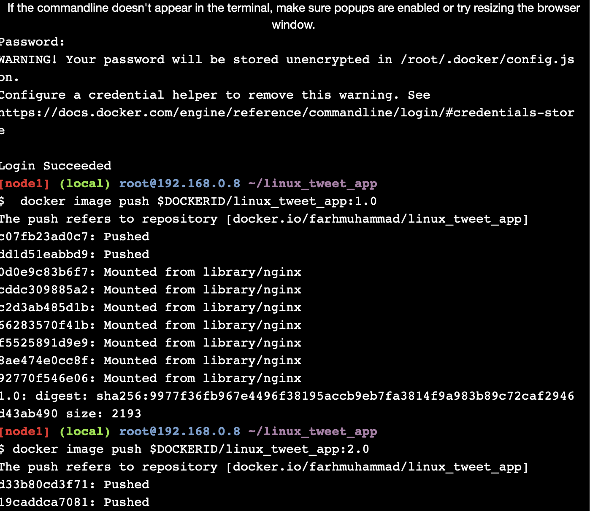

# Tugas 9

### Task 1: Run some simple Docker containers

1. Clone and start new container with the name "hostname".
   
2. List all containers and run an interactive Ubuntu container.
   
3. Run a new MySQL container.
   
4. Logs
   
5. List the MySQL version using docker container exec.
   

### Task 2: Package and run a custom app using Docker

1. Linux Tweet App
   

### Task 3: Modify a running website

1. Rerun website after exit
2. Modify the running website
   
3. Update the image
   
4. Test the new version
   
5. Push image to Docker Hub
   
