# Tugas 10

### Section 1 - Networking Basics

1. Docker network command.
   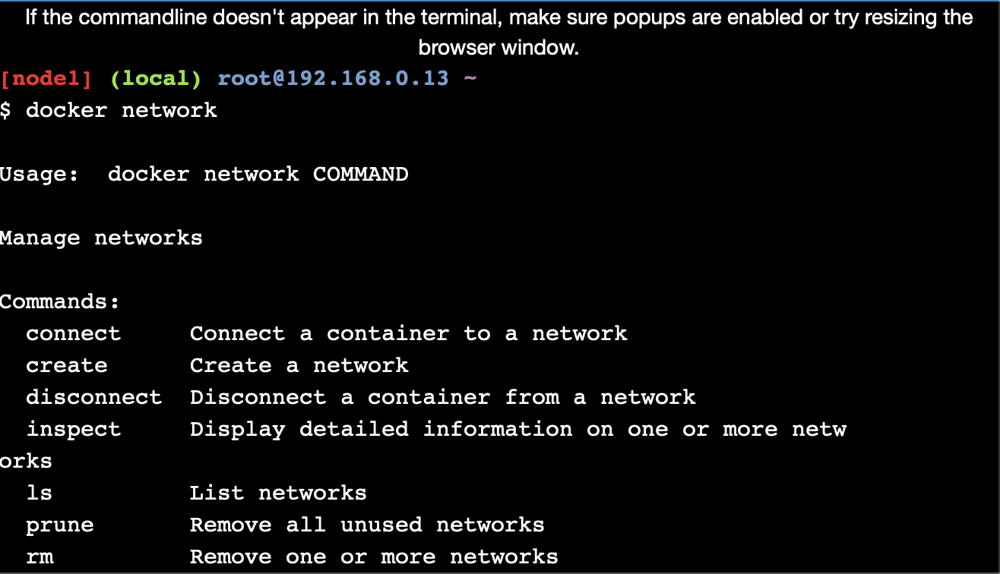
2. List network.
   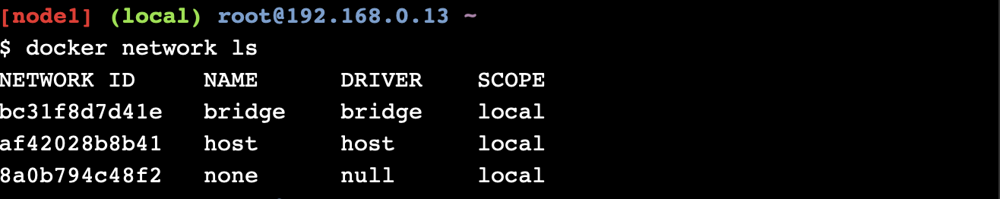
3. Inspect network.
   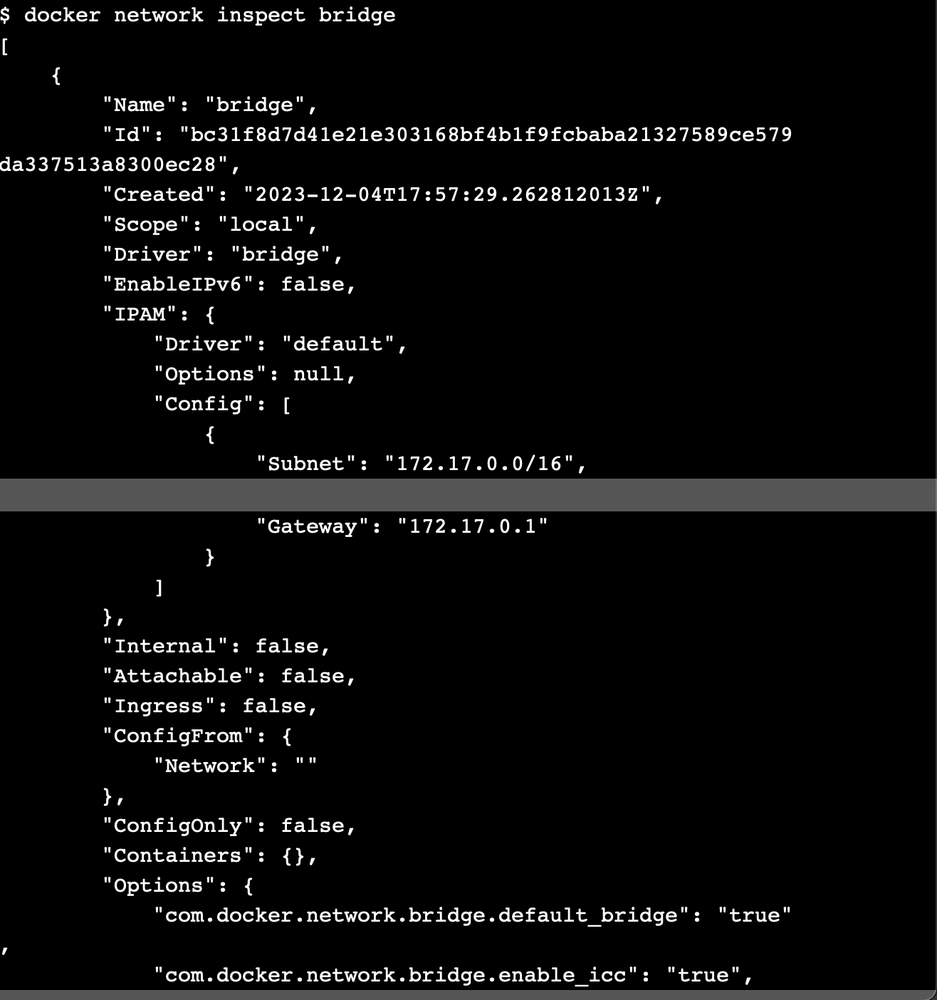
4. Docker info.
   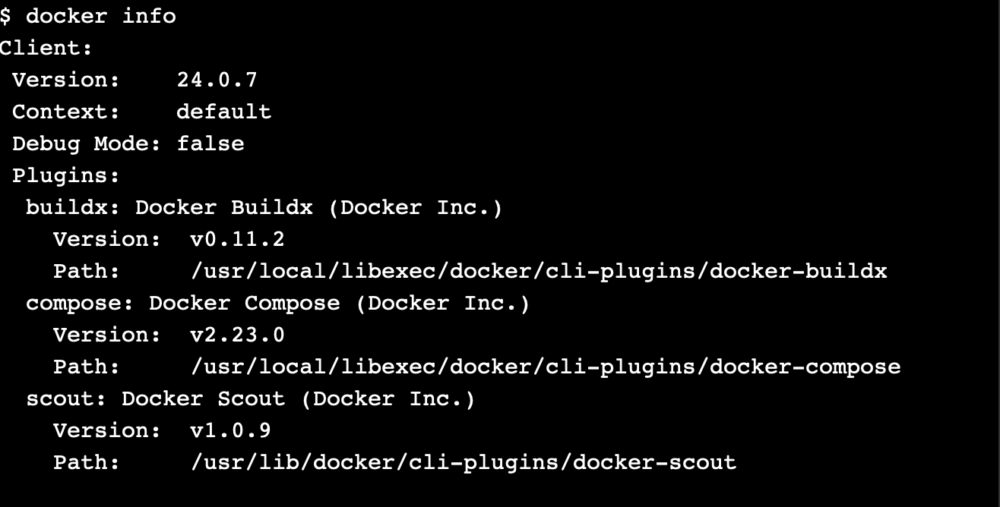

### Section 2 - Bridge Nwtworking

1. The Basics.
   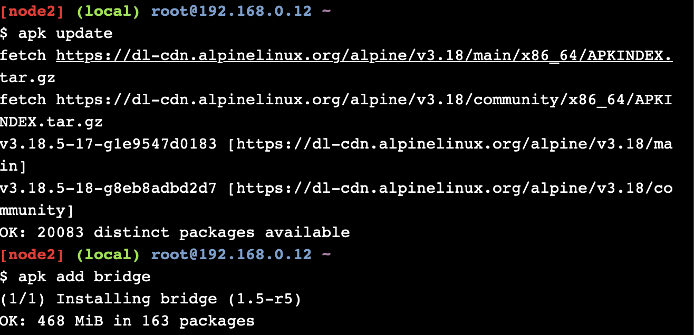
   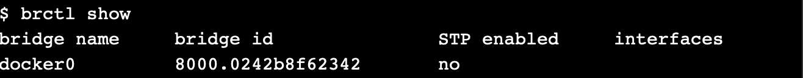
   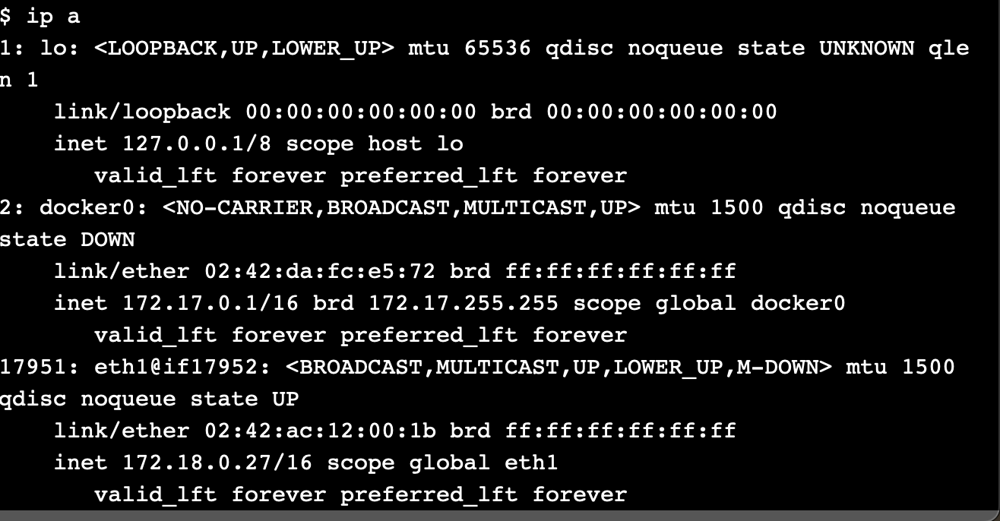
2. Connect a container.
   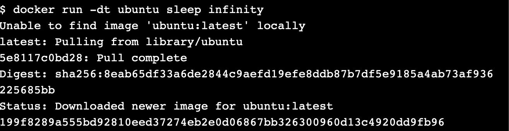
3. Test network connectivity.
   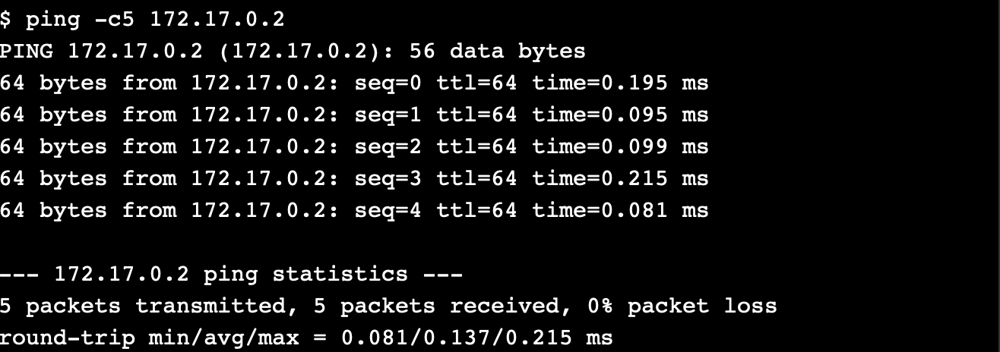
4. Configure NAT for external connectivity.
   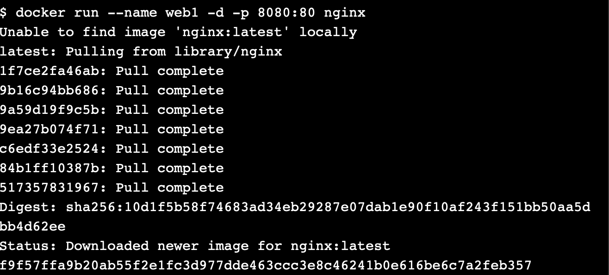
   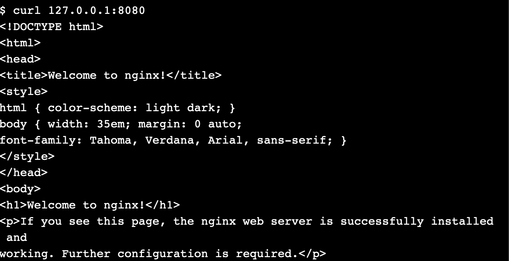

### Section 3 - Overlay Networking

1. The Basics.
   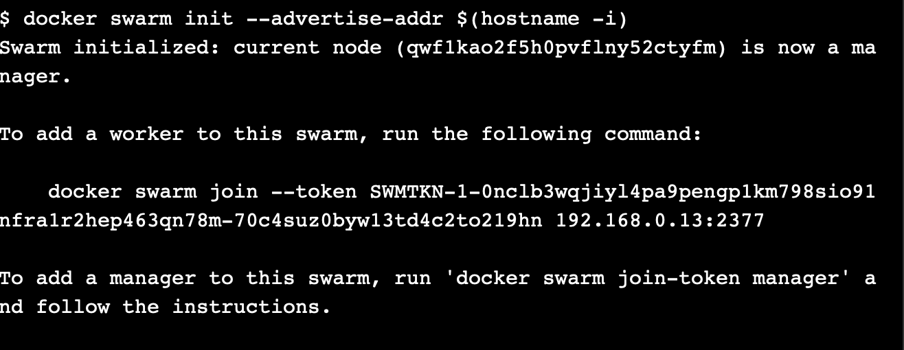
2. Create an overlay network.
   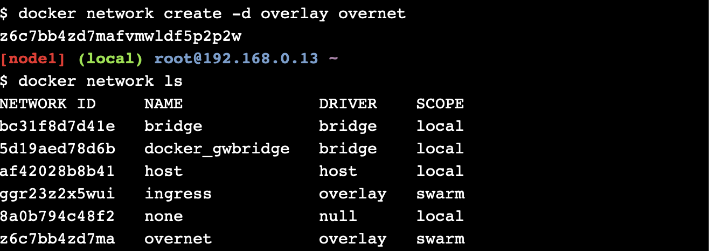
   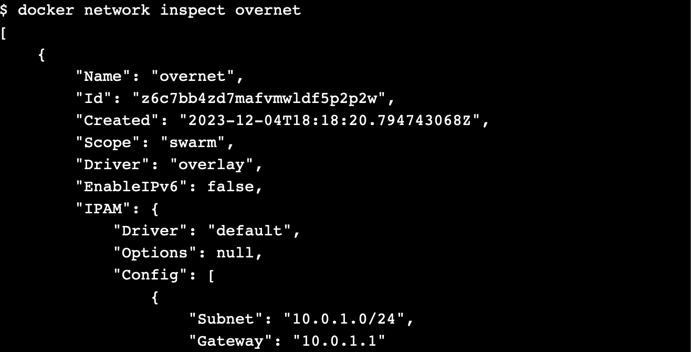
3. Create a service.
   
   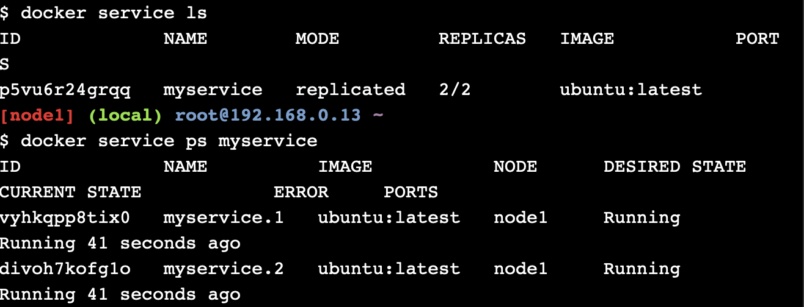
4. Test the network.
   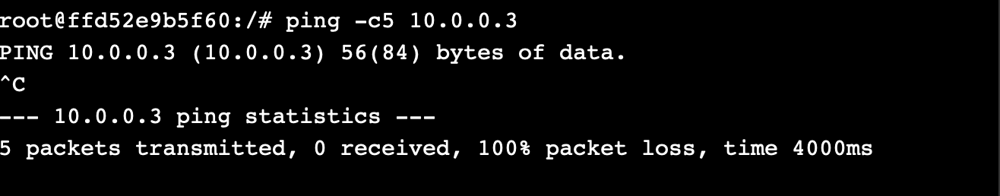
5. Test service discovery.
   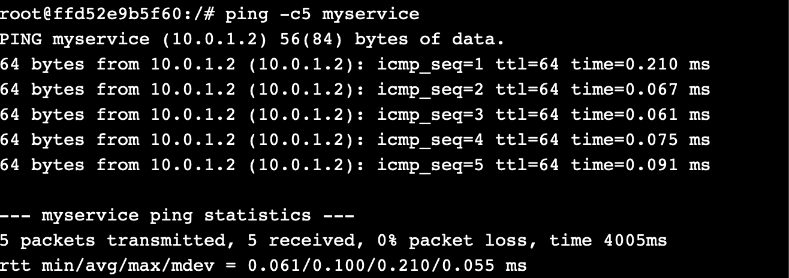

### Cleaning Up

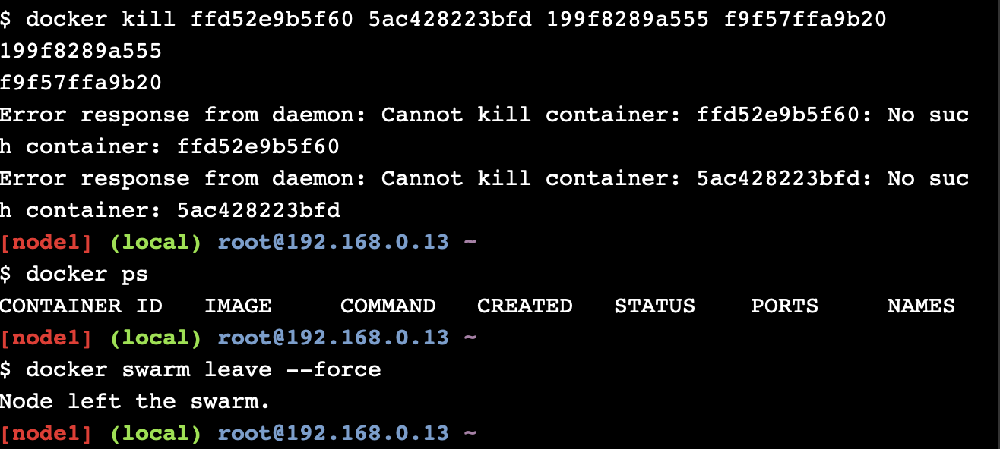
