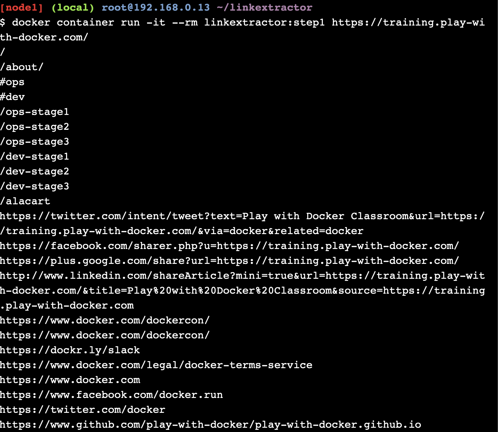
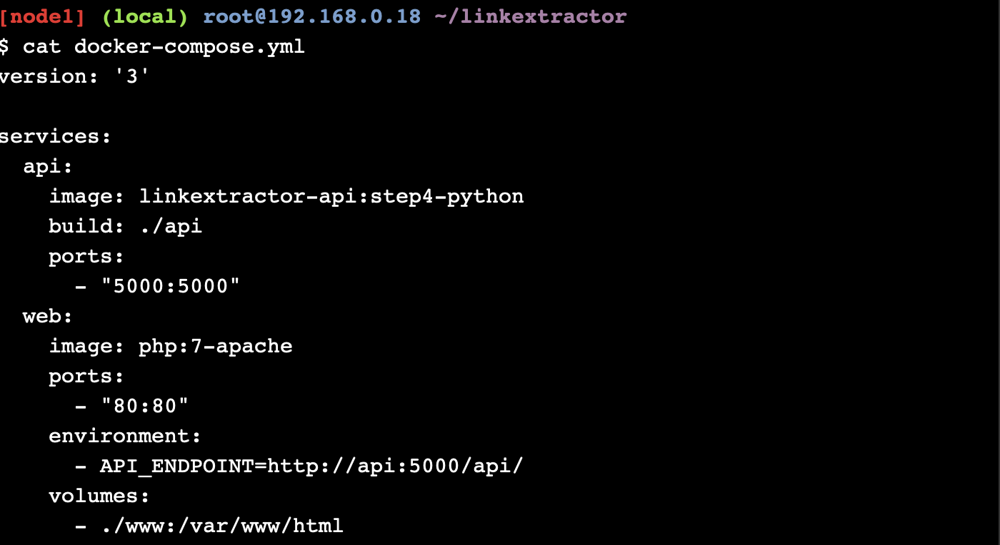

# Tugas 11 - Application Containerization and Microservice Orchestration

## Setup


```
// clone repository dari url github
git clone https://github.com/ibnesayeed/linkextractor.git

// move ke direktori linkextractor
cd linkextractor

// move ke branch demo
git checkout demo
```

## Step 0: Basic Link Extractor Script


```
// move ke branch step0
$ git checkout step0

// show struktur folder
$ tree
```


```
// tampilkan isi file linkextractor.py
cat linkextractor.py

// run file linkextractor.py
./linkextractor.py http://example.com/
```


```
// melihat hak akses file linkextractor.py
ls -l linkextractor.py

// run file linkextractor.py
python3 linkextractor.py
```

## Step 1: Containerized Link Extractor Script


```
// move ke branch step1
git checkout step1

// show struktur folder
tree
```


```
// show isi file Dockerfile
cat Dockerfile

// create/build image
docker image build -t linkextractor:step1 .

// show daftar image
docker image ls

// run container docker
docker container run -it --rm linkextractor:step1 http://example.com/
```


```
// run container
docker container run -it --rm linkextractor:step1 https://training.play-with-docker.com/
```

## Step 2: Link Extractor Module with Full URI and Anchor Text


```
// move ke branch step2
git checkout step2

// show struktur folder
tree
```


```
// show isi file linkextractor.py
cat linkextractor.py
```


```
// create/build image
docker image build -t linkextractor:step2 .
```


```
// menampilkan image
docker image ls
```


```
// run container docker
docker container run -it --rm linkextractor:step2 https://training.play-with-docker.com/
```



```
// run container docker
docker container run -it --rm linkextractor:step1 https://training.play-with-docker.com/
```

## Step 3: Link Extractor API Service


```
// move ke branch step3
git checkout step3

// menampilkan struktur folder
tree
```


```
// show isi file Dockerfile
cat Dockerfile
```


```
// show isi file main.py
cat main.py
```


```
// create/build docker
docker image build -t linkextractor:step3 .
```


```
// run container
docker container run -d -p 5000:5000 --name=linkextractor linkextractor:step3

// show daftar container
docker container ls

// create request HTTP
curl -i http://localhost:5000/api/http://example.com/
```


```
// show log container
docker container logs linkextractor

// remove container
docker container rm -f linkextractor
```

## Step 4: Link Extractor API and Web Front End Services


```
// move ke branch step4
git checkout step4

// menampilkan struktur folder
tree
```



```
// show file docker-compose.yml
cat docker-compose.yml
```


```
// show file www/index.php
cat www/index.php
```


```
// run docker compose
docker-compose up -d --build
```


```
// show daftar container
docker container ls

// menghubungkan dengan layanan API
curl -i http://localhost:5000/api/http://example.com/

// modifikasi index file link extractor
sed -i 's/Link Extractor/Super Link Extractor/g' www/index.php

// reset perubahan
git reset --hard

// menghentikan layanan
docker-compose down
```

## Step 5: Redis Service for Caching


```
// move ke branch step5
$ git checkout step5

// show struktur folder
$ tree

// show file www/Dockerfile
$ cat www/Dockerfile
```


```
// show file api/main.py
cat api/main.py
```


```
// show file docker-compose.yml
cat docker-compose.yml
```


```
// build layanan
docker-compose up -d --build
```


```
// client redis
docker-compose exec redis redis-cli monitor

// modifikasi index file link extractor
sed -i 's/Link Extractor/Super Link Extractor/g' www/index.php

// reset perubahan
git reset --hard

// stop service
docker-compose down
```

## Step 6: Swap Python API Service with Ruby


```
// move ke branch step6
$ git checkout step6

// show struktur folder
$ tree
```


```
// show file api/linkextractor.rb
cat api/linkextractor.rb
```


```
// show file api/Dockerfile
cat api/Dockerfile
```


```
// show file docker-compose.yml
cat docker-compose.yml
```


```
// run service
docker-compose up -d --build
```


```
// menghubungkan service
curl -i http://localhost:4567/api/http://example.com/
```


```
// stop service
docker-compose down

// show log
cat logs/extraction.log
```
