# Tugas 12 - Docker Orchestration Hands-on Lab

## Konfigurasi Swarm Mode

1. Membuat container baru pada terminal node1
   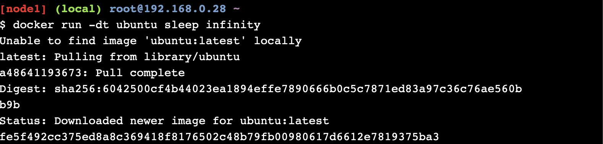

```
// Menggunakan container terbaru
$ docker run -dt ubuntu sleep infinity
```

2. Melihat daftar container
   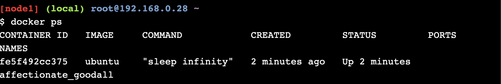

```
$ docker ps
```

3. Inisiasi docker swarm
   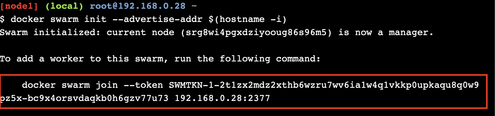

```
$ docker swarm init --advertise-addr $(hostname -i)

// akan mendapatkan token untuk menggabungkan dengan node lain
```

4. Melihat informasi docker swarm pada node1
   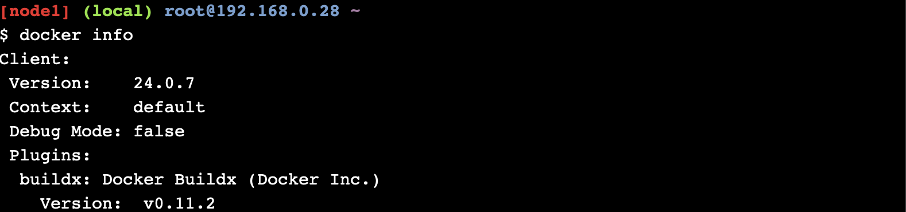
   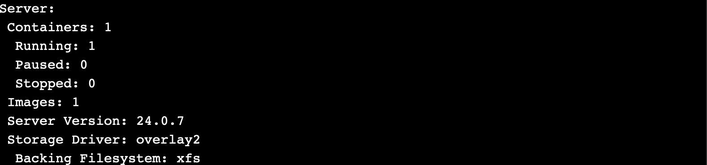
   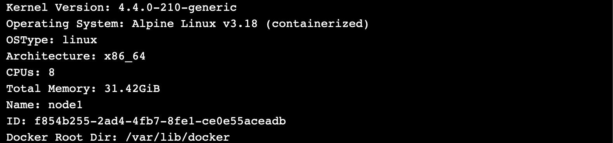

```
$ docker info
```

5. Menggabungkan node2 dan node3 kedalam swarm node1 menggunakan token yang telah didapatkan di node1.
   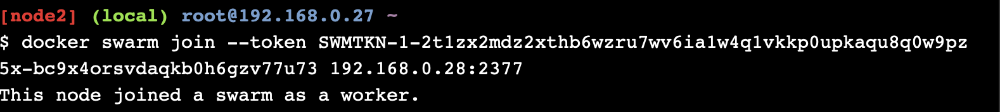
   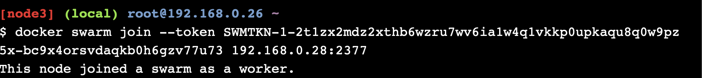

```
// node2 dan node3 telah terhubung dengan swarm node1 sebagai worker
```

6. Melihat daftar node
   

## Deploy aplikasi antar hosts

7. Deploy komponen aplikasi sebagai service Docker
   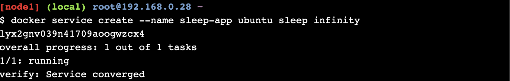

8. Cek seluruh servis docker yang berjalan
   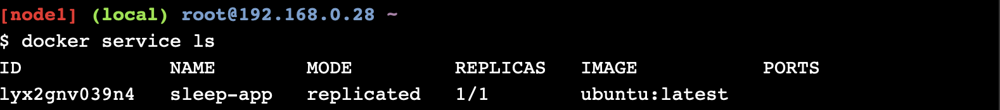

## Eskalasi aplikasi

9. Mereplika layanan yang sama dengan skala 7
   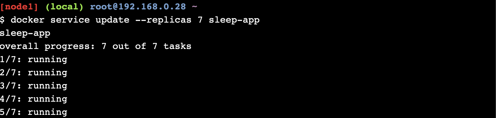
   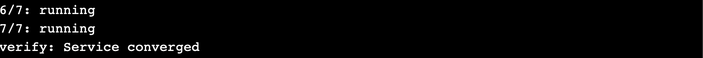

10. Melihat layanan yang sedang berjalan
    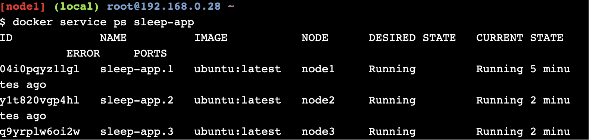
    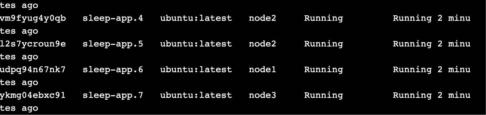

11. Mereplika layanan yang sama dengan skala 4
    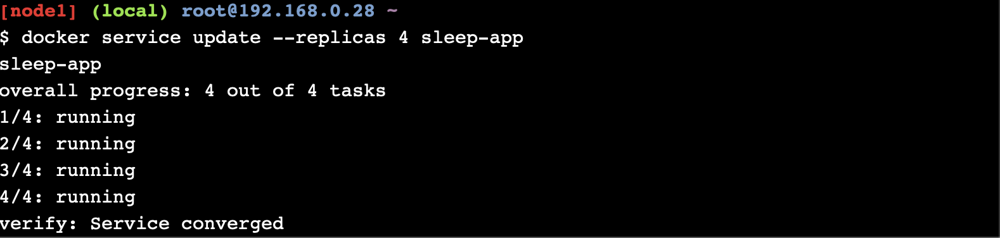

12. Melihat layanan yang sedang berjalan
    
    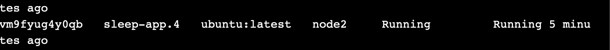

13. Melihat daftar node
    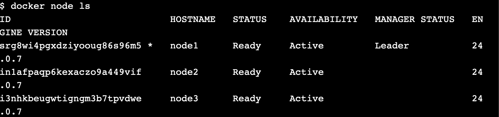

## Drain node dan lakukan jadwal ulang container

14. Melihat daftar container
    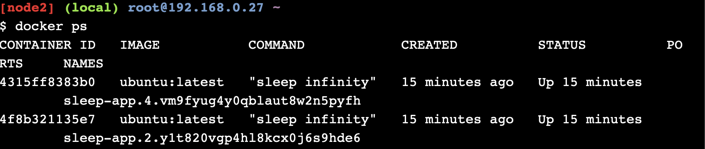

15. Melihat kembali daftar node yang ada.
    

16. Mengubah availability node 2 menjadi drain
    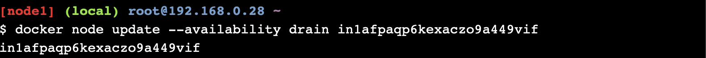

17. Hasil
    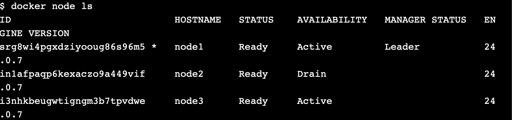

18. Melihat container yang berjalan pada node2
    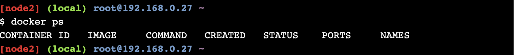

```
// Container kosong karena node2 availability sebelumnya telah diubah menjadi drain
```

19. Melihat layanan yang sedang berjalan
    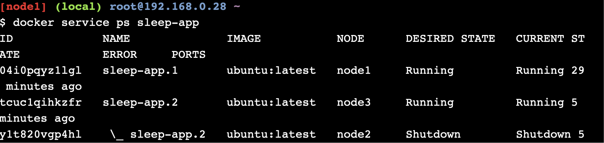
    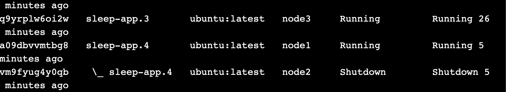

```
// layanan yang menggunakan node2 terhenti
```

## Clean up

20. Menghapus layanan
    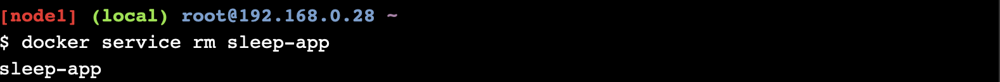

21. Melihat daftar container yang ada
    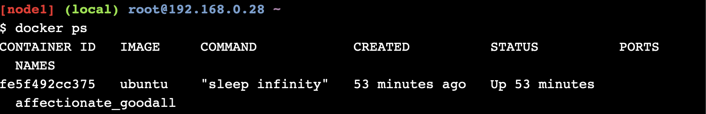

22. Menghapus container
    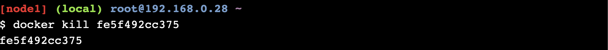

23. Menghapus swarm pada node1, node2 dan node3
    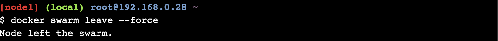
    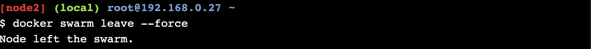
    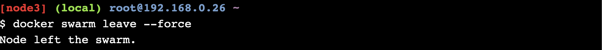
