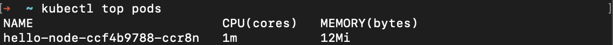

# Tugas 12 - Learn Kubernetes Basics

## Membuat Cluster Minikube


```
$ minikube start
```

## Membuka Dashboard

Ada 2 cara untuk membuka dashboard, langsung membuka browser atau dengan mendapatkan URL terlebih dahulu. Kemudian copy URL tersebut di browser.


```
// cara pertama
$ minikube dashboard

// cara kedua
$ minikube dashboard --url
```

## Melakukan Deployment Aplikasi

1. Menggunakan `kubectl create`


2. Melihat deployment


3. Melihat pod


4. Melihat cluster events


5. Melihat konfigurasi `kubectl`


6. Melihat log aplikasi


## Membuat Servis

1. Expose pods ke publik menggunakan `kubectl expose`


2. Melihat servis yang telah dibuat


3. Menjalankan servis dan akan membuka browser


## Mengaktifkan Addons

1. Melihat addons yang mendukung


2. Mengaktifkan addons metric-server


3. Melihat pods dan servis


4. Cek output dari metric-server



5. Menonaktifkan addons metric-server


## Pembersihan (Clean up)

1. Membersihkan resource


2. Menghentikan minikube


